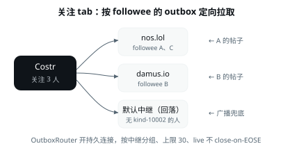

# Costr

**Costr = Chinese Nostr** —— 一个更适合中文用户的去中心化社交客户端，单一代码库
（Flutter）覆盖 Android、iOS、Windows、macOS、Linux 五端。你自己就是一个广播站：
帖子分布在全球多台服务器上，没有任何人——包括 Costr 自己——能删除、封号或限流。

---

## 下载

| 平台 | 版本 | 文件 |
| --- | --- | --- |
| Android | **1.1.2** | [`app-release.apk`](https://github.com/costr1024/costr/releases/download/v1.1.2/app-release.apk)（≈72 MB，universal APK，含 arm64/arm/x86_64/x64 全 ABI） |

> 当前为正式版（v1.1.2）。Android 包 `applicationId = com.costr.costr`，用正式
> release keystore 自签（SHA-256 `4851d3b7…95eeaa`）。安装需在系统设置中允许「未知来源」。
> 桌面端（Linux/Windows/macOS）与 iOS 暂未发版，可从源码自行编译。
>
> **覆盖安装即可**：versionCode 递增、签名密钥不变，Android 允许直接升级安装，
> 登录 / 关注 / 屏蔽列表 / 收藏 / 本地缓存全部保留，无需卸载旧版。
> （仅当签名密钥变更导致 INSTALL_FAILED_VERIFICATION_FAILURE 时才需先卸载。）
> 注：0.6-beta 曾有覆盖升级后启动卡死的个例（旧版本遗留的本地缓存库在个别设备上
> 打开即卡住）；主干已修复——启动时探测继承的缓存库，损坏/超时自动隔离重建，并加
> keystore 读取限时与启动看门狗，覆盖升级不再卡死（见「当前状态 → v0.6-beta 后续修复」）。
>
> release 包曾缺 `INTERNET` 权限（仅 debug 变体声明），导致 release 连不上中继——
> 已把 `uses-permission INTERNET` 提到主 manifest，对所有构建变体生效。选图/视频/文件
> 走 SAF 系统选择器，无需额外存储或相机权限。

> 全部历史版本见 [Releases](https://github.com/costr1024/costr/releases)（v0.1.5-beta / v0.2-beta / v0.3-beta / v0.5-beta / v0.5.5-beta / v0.6-beta / v0.6.1-beta / v0.6.2-beta / v0.6.3-beta / v0.6.4-beta / v0.6.5-beta / v0.6.6-beta / v0.6.8-beta / v0.6.9-beta / v0.8-beta / v0.8.1-beta / v0.8.2-beta / v0.8.3-beta / v0.8.4-beta / v0.8.5-beta / v0.8.6-beta / v0.8.7-beta / v0.8.8-beta / v0.8.9-beta / v0.9-beta / v0.10-beta / v0.11-beta / v0.11.1-beta / v0.11.2-beta / v0.11.3-beta / v1.0.0 正式版 / v1.0.1 正式版 / v1.0.2 正式版 / v1.0.3 正式版 / v1.0.4 正式版 / v1.0.5 正式版 / v1.0.6 正式版 / v1.0.7 正式版 / v1.0.8 正式版 / v1.0.9 正式版 / v1.0.10 正式版 / v1.1.0 正式版 / v1.1.1 正式版 / **v1.1.2 正式版**）。

---

## 核心设计思路与产品理念

Costr 的设计原则写在其 [设计宪法](docs/DESIGN.md) 里，核心可归纳为：

1. **无审查是第一卖点**。帖子分布在全网多台中继上，没有任何人能删、能封、能限流。
   这是去中心化带来的硬保证，也是 Costr 存在的理由。
2. **匿名，一把钥匙就是身份**。不用手机号、不用邮箱、不实名。一串 `nsec1` 钥匙就是
   整个账号，不绑定任何现实身份。私钥只在本机、不上传任何服务器；想更进一步隐身，
   搭配 VPN 代理服务用，中继连你的真实网络地址都看不到。
3. **复刻 X（推特）的 UI 语言**。布局、信息架构、配色、动作栏都对标 X 浅色风格
   （纯白底 + 黑主色），让从 X 迁来的用户零学习成本。技术名词（中继、npub、NIP、kind）
   **一律不出现在主界面**，需要时用比喻说人话（见关于页的「发件箱 / 收件箱」比喻）。
4. **开箱即用、克制不打扰**。默认值即最佳值，不给用户一堆开关去调。信息是公开的，
   但体验是安静的——通知聚合、批量刷新、后台不订阅、回前台不整页 reload。
5. **性能从设计阶段就守**。订阅有界、去重、聚合优先、批量更新、后台不持有 WebSocket、
   firehose 默认不验签——见 [性能约束](docs/DESIGN.md#10-性能约束设计阶段就要守)。

设计优先级裁决规则：**复刻 X > 简约年轻 > 开箱即用 > 性能 > 个性化**。冲突时砍掉低优先级的。

---

## 与其他 Nostr 客户端的差异

| 维度 | Costr | Amethyst / Damus / Jumble |
| --- | --- | --- |
| 目标用户 | 中国年轻用户（用过 X、不懂去中心化） | 英文 / 通用社区 |
| UI 语言 | 复刻 X 浅色风格，全中文文案，技术词不上主界面 | 各自风格，常见技术词暴露 |
| 语言过滤 | 首页内建 🌐/🇨🇳/🇬🇧/🇯🇵 启发式过滤（前 100 个非 URL 字符的主导文字判定；纯链接帖全语言可见） | 多无内建语言过滤 |
| 大陆可达 | 默认中继含 `damus.bostr.online` 反代便于直连；NIP-42 AUTH 已支持 | 默认中继常被墙 |
| 关注流拉取 | 按每个 followee 的 NIP-65 outbox 定向拉取（分组、30 上限、回落广播） | 多为广播到默认中继 |
| 单用户主页 | outbox 定向拉取（`fetchFromUrls` + `since` 增量） | 类似 outbox 路由 |
| 发布可靠性 | per-relay 1s/2s/3s 重试 + 全失败存草稿跨会话补发 | 多为单次广播 |
| 自定义表情/打闪 | NIP-30 + NIP-57 Zap（中文文案：打闪 / 聪） | 视客户端而定 |
| 本地缓存 | drift/SQLite，社交图谱 gated 持久化 + 30 天清理 | 各有缓存策略 |
| 代码库 | Flutter 单码库五端 | Android 原生 / Flutter / Web 各异 |

Costr 不重新发明 Nostr 协议——纯 Dart 协议层实现遵循 NIP 规范，交互与渲染先参考
Amethyst/Jumble 的成熟做法（见记忆 `reference-nostr-clients`），再按 X 风格与中文用户
偏好裁剪。

---

## 核心界面

> 交互稿见 [docs/ui_demo.html](docs/ui_demo.html)（浏览器打开即用，`1/2/3/4` 切 tab、
> `C` 发帖、`L` 登录、`Esc` 返回）。下面是核心界面的 SVG 概览图，配色取自设计宪法
> §3（纯白底 + 黑 `#0F1419` 主色）。

### 4-tab + FAB 主架构


### 关注流的 NIP-65 outbox 路由



界面与流程清单：**首页**（全球/关注切换 + 语言过滤 + 帖子流，正文裸网页链接带 Open Graph
预览卡）｜**搜索**（用户/帖子 NIP-50）
｜**通知**（全部/提及 + 聚合）｜**我的**（banner/头像/资料 + 帖子/回帖/关注/关注者/收藏）
｜**发帖**（FAB，带 Blossom 媒体上传）｜**帖子详情**（回复线程）｜**登录/注册**（多步向导）
｜**设置**（通知/**多账号切换**/账号备份/服务器节点/关于/退出）｜**关于**（产品理念 + Nostr 原理图）。

---

## 技术架构

### 分层

```
lib/
  app/        app 外壳：GoRouter 路由、Riverpod providers、X 风格主题
  models/     NIP-01 Event（解析、p-tag、hashtags、computeId、验签 hook）
  nostr/      纯 Dart 协议层（可独立于 UI 复用/测试）
    identity.dart        Identity（nsec1 → BIP-340 公钥，signEvent）
    actions.dart         NostrActions（reply/repost/quote/reaction/follow/relayList）
    nip44.dart           NIP-44 v2 加密（纯 Dart，私人书签用）
    relay_client.dart    WebSocket 中继连接（长生命周期广播，EOSE/AUTH，重连退避）
    relay_pool.dart      RelayPool（去重合并流、重发、NIP-42 AUTH、fetchFromUrls outbox）
    outbox_router.dart   ★ 关注流 NIP-65 outbox 路由（持久分组连接 + fetchOnce 分页）
    event_store.dart     内存存储（去重/排序/上限 5000）
  services/   drift/SQLite 本地缓存、NIP-57 打闪、Blossom 上传、媒体下载、安全存储
  features/   feed / profile / compose / notifications / search / settings / auth
  widgets/    markdown 正文、动作栏、头像、Costr logo、新手引导
  utils/      bech32 / nip19 / language
```

### 信息流拉取（关键设计）

- **全球 tab**：`feedSubscriptionProvider` → `pool.request({kinds:[0,1,6,7], limit:200},
  onEvent: window.ingest)` 广播到 9 台默认中继，**live 不 close-on-EOSE**（实时
  reaction/metadata 持续到达）。事件按**订阅级路由**（RelayPool 的 EVENT 帧自带 subId，
  `onEvent` 订阅的应答只进回调、不进池合并流）直入纯内存 `GlobalFeedWindow` 临时窗口
  （≤1000 帖按时间倒序 / 仅保留指向窗口内帖的互动 / 每人最新 kind-0，跨中继去重、全部分层
  有上限），**不进 2 万条事件库、不写 SQLite，离开 tab 整窗清空**——20000 条上限专供关注流
  + 相关事件（全球信息流「偶尔看一眼」，不做任何持久缓存）。翻页（`_loadMoreGlobal` 的
  `until` 页）同样路由进窗口。全球 tab 的渲染 / 语言过滤 / 互动计数全部以窗口为源。
- **关注 tab**：`followingOutboxProvider` → `OutboxRouter` 按 followee 的 kind-10002 outbox
  分组定向拉取（详见上面的 SVG）。事件经 `EventStoreNotifier.ingest` 入内存库，`currentFeedEventsProvider`
  既有 `follows.contains(pubkey)` 过滤复用，UI 零改动。
- **关注下拉的 #tag 过滤（真查中继）**：选中关注的标签后 `followingTagFeedProvider` 向默认池
  广播 live `#t` 订阅（Amethyst 模式：`#t` 值带 `hashtagAlts` 大小写变体——中继按大小写敏感
  匹配 t 值；`kinds [1,6]`、`limit 100`，内存库已有带 tag 帖时带 `since` 增量），outbox 路由
  同时暂停，信息流来源切换为该 tag 的时间线（帖子可来自**未关注**的作者，`#t` 之上的作者限制
  解除）；翻页 `_loadMoreTag` 按 `until` 回翻更早的带 tag 帖。此前的纯客户端过滤只能看到已加载
  关注流里最近几天的带 tag 帖；不支持 `#t` 的中继只是不应答，不影响其他中继返回结果。
- **个人主页**：`userPostsProvider` → `fetchFromUrls` 临时连接对方 outbox read 中继
  （每次拉最新 `limit:100` 窗口、250ms 去抖流式 yield，经 `yield* ctrl.stream` 吐出），无清单回落广播。
- **资料 / 头像拉取**：`metadataProvider` 三级查找——SQLite 缓存 → 默认池 + indexer 池
  并发 kind-0；两级都冷 miss 时，回落到对方 NIP-65 outbox read 中继（`fetchFromUrls` 临时
  连接）。对方 kind-10002 中继清单本身也由 `userRelayListProvider` **默认池 + indexer 池并发**
  拉取（只在 indexer 上的清单也能找到），避免只在自家 outbox 发布资料的用户头像/主页永久
  加载不出。
- **帖子详情 / 回帖线程**：`threadAncestorsProvider`（上级链）按 NIP-10 `e`-tag 并行 BFS 上溯，
  tier-1 默认池广播 miss 后 **tier-2 用 `e`-tag 自带的 relay hint 定向 `fetchFromUrls`**
  （nevent/回复自带的中继提示往往是线程所在处）；`repliesProvider`（下级回帖）默认池 REQ
  之外**并发**拉取**被回帖作者 outbox read 中继**的 `#e` 回帖，回帖按 **时间线 + 层级**
  （`threadReplies`：父子树深度优先、同层最旧在前、按深度缩进）展示而非扁平 createdAt 倒序。
  回帖流收尾恒吐一次快照（即便空），避免零回复时 `StreamProvider` 卡在 `AsyncLoading` 转圈圈。
  **按 id 查找抗抖动**：`eventByIdProvider` 的默认池广播放在按 id 共享的在途 Future 里（不绑定
  单个 provider 生命周期）——页面重建引起的 provider dispose/重建不再掐断监听、丢弃中继迟到
  的应答，重建后的查找直接并入同一在途请求（也不重复发 REQ）；中继对订阅回 `CLOSED`（如
  relay.ditto.pub 单连接订阅超限时回 "rate-limited: too many subscriptions"）时按「该中继已
  应答」合成 EOSE，全 miss 快速收敛不再被它拖满超时。**上级链加载不全可重试**：链顶帖本身仍
  是回帖（父帖没取到——父帖所在中继当时掉线/限流，或原帖已删）时，线程顶部显示「上面的对话
  没加载出来」+ 重试按钮，点击清掉缓存的 miss 并重跑上溯；此前一次性查找把 miss 缓存到底，
  中继恢复后整个会话也看不到父帖（只活在单台桥接 relay 上的长毛象桥线程尤其容易中招）。
  **发送回复后立即可见**：回帖流是一次性加载（EOSE 即关），用户打完字时流早已关闭、且发布本地
  回显走 `events` 流而非回帖流监听的 `rawEvents`，旧实现回复后必须退出重进主贴才能看到；现在
  发送成功后先 awaited 落库（`cacheThreadEvent`）再 `invalidate` 父帖 `repliesProvider`，
  回到线程页即从 SQLite→中继重查显示（Amethyst 式发送即入库）。**二级及以上回复同样可见**：
  回复一条回帖时，invalidate 的是 `{直接父帖, 线程 root}` 两个回帖列表——用户停留的线程页
  watch 的是 root 的 `repliesProvider`，只刷直接父帖会让嵌套回复不可见（新回复自带 root
  `e`-tag，本就属于 root 回帖列表）。
  **转发嵌套**（`repostedEventProvider`）：优先解析 kind-6 自带的 NIP-18 内嵌 JSON（即时、
  无网络），miss 时依次兜底：缓存/默认池广播 → `e`-tag relay hint 定向 `fetchFromUrls` →
  **被转者 NIP-65 outbox**（repost 的 `p` 标签取被转者，去其写中继按 id 定向拉——专治
  「转发内容不可用」：被转帖不在用户已连中继、repost 又没带 relay hint 时仍能取回）。
  取到即落 SQLite，重复刷到秒出；彻底取不到时卡片给「重试」（provider 缓存 null，不手动
  invalidate 会永久「不可用」）。
- **通知聚合**（`notificationsProvider`）：`#p` 提及 + `#e` 互动按 `type:target` 聚合成 X 式
  分组条目。**关注**按 **follower pubkey** 聚合（kind-3 每改一次都是新 event id，按 event id
  聚合会出现同一用户多条「关注你」），点关注通知跳转该 follower 主页；**repost**（kind-6）
  解析 NIP-18 内嵌 JSON 取**被转帖子的正文**做预览；**reaction**（kind-7）解析 NIP-30
  `:shortcode:` + `emoji` tag 渲染自定义表情图片，不再裸露 `:xxx:` 文本。
  **同 id 剥离变体防御**：有 relay（实测 top.testrelay.top）会对同一 event id 下发**被剥掉
  emoji tag 的变体**（id 本应承诺 tags，该变体按 NIP-01 属无效事件）；互动索引与「点赞与
  转发」列表在三层（store/缓存/全球窗口）合并时同 id 冲突**取 tag 更全的副本**——旧的
  store 优先短路会让 chip 在剥离副本落库瞬间从表情图闪回 `:xxx:`，而列表页因缓存覆盖
  store 仍显示图，两处不一致。
  **点通知跳对帖**：`notificationReferencedId` 按 NIP-10 marker 优先级（reply＞无 marker＞root）
  在「我的帖」里取被互动的帖——回复/点赞同时带 root+reply 两个 e-tag 且都是我的帖时，旧的首个
  命中扫描会取到 root（tag 里排前面），导致点通知跳到 root 主贴；现取 reply marker 的帖。跳转目标
  按类型分：**回复/提及**打开进来的那条回帖本身（`sourceEventId`，用户要看的是新回帖不是自己的帖），
  **点赞/转发**打开被点赞/被转发的自己的帖子（`targetEventId`，kind-7/6 事件本身不是可展示的帖）。
- **媒体加载**（头像/帖子图片/视频）：`CostrNetworkImage` 走带超时的 `flutter_cache_manager`
  FileService——**连接+响应 8s 硬超时**（默认无超时，被墙域名要等 OS TCP 30–60s 才报失败）+ 浏览器
  UA（部分图床/代理 403 非浏览器 UA，导致代理 URL 浏览器能开、app 开不了）。**代理媒体是本地可配置项**
  （设置 → 代理媒体开关，**不同步中继**）：开启后凡含图/视频链接的帖子在昵称右侧常显「代理媒体」按钮
  （无媒体不显示），点按切换该帖图/视频走 `https://proxy.bostr.online/<origin-domain>/<path>`
  （原 URL **去掉 scheme 前缀**——带 `https://` 拼接会被代理解析成非法域名返回 400，图裂）；
  关闭则永不显示。
  媒体查看器全屏页有「使用代理加载」点按重试；顶栏另有「复制图片链接」按钮（链条图标），
  复制**当前图**的原始 URL（非代理镜像），不便保存时可直接分享链接。
  **tag 声明的媒体按 MIME 渲染**：`["video", url, mime]` / imeta tag 声明的 URL，即使裸链
  没有 `.mp4` 等文件扩展名（如抖音分享链 `…/playwm/?video_id=…`），也按 tag 的 MIME 渲染
  内联播放器/九宫格（此前只当普通可点链接，需跳浏览器；对齐 Amethyst）。
- **沉浸式浏览**（`ImmersiveScaffold` + `ImmersiveScrollDetector` + 全局 `appBarsVisibleProvider`）：
  **本地可配置项**（设置 → 沉浸式浏览，**不同步中继**），默认关。开启后向下滚动 40px 隐藏顶部 AppBar +
  底部导航栏 + 发帖 FAB（220ms 动画），向上滚或回到顶部立即恢复；切 tab 自动回显。关闭时各页
  `Scaffold(appBar:, body:)` 与改造前逐字节一致（零回归）——顶栏折叠只在开关开启时走 `AnimatedContainer`/
  `AnimatedSlide` 分支。**只响应竖向滚动**：卡片内嵌的横向滚动控件（作者状态行）的滚动事件不参与
  隐藏/恢复判定（depth/轴向过滤前它们会随机乱跳顶/底栏）。配套快捷键：双击首页「全球/关注」、
  通知「全部/提及」页签行（`DoubleTapShortcut`，Listener 实现不与子级点按抢手势）平滑滚回最新内容。
- **关注 / 取消关注**（`followUser`/`unfollowUser`）：**乐观更新**——签名后立即更新本地 kind-3 缓存 +
  `followingStateProvider`，`publishAndWait` 落到后台，按钮不再卡 5–20s 等中继 ACK；失败时 invalidate 重拉对账。
- **关注集分组**（`_buildFollowGroups`）：按 kind-30000 的 **`d` tag**（稳定标识）分组，组名取该 d 下
  **最新**修订的 `name` tag（回落 `d`）。Amethyst 把 UUID 放 `d`、人名放 `name`，旧修订无 `name`；
  按显示名分组会把同一列表拆成「中文」「UUID」两条并闪烁——按 `d` 分组塌成一条。
  **陈旧修订防御**（修「列表名偶尔变 UUID、强退重开恢复」）：不同中继持有同一列表的不同修订（某中继
  错过了重命名，仍在发无 `name` 的旧版），三处按「最新修订必胜」收敛：① `LocalCache.writeEvent`
  对 replaceable 事件加 createdAt 新胜守卫（此前 `insertOnConflictUpdate` 后到旧版会永久盖掉新版行）；
  ② `userGroupedFollowsProvider`/`userGroupNamesProvider` 的中继刷新不再在**首个 EOSE** 收尾——
  最快中继若恰好只有无 `name` 旧版，组名会回落 UUID 且本次会话不再刷新（只有重启才重拉）；现在等
  **全部已连接中继 EOSE**（10s 兜底）、每个 EOSE 增量吐一次快照，并用 SQLite 行给中继窗口播种
  （缓存最新版必胜）；③ `_addToCategoryList` 的中继兜底改为收集到全部 EOSE 后取**显示名匹配的最新
  修订**（首个命中可能是旧修订，其 `p` 名单会被 `followCategory` 沿用导致静默丢成员）。kind-3 同款：
  摄取与分组刷新都按 createdAt 新胜，旧版后到不再回退关注列表。
- **全局搜索**（`/search`）：可见的填充式圆角搜索框 + 全部/帖子/用户 SegmentedButton 筛选（默认全部）。
  搜索框带 **X 一键清空**（Amethyst 式）；把关键词删空同样触发——清空即 `invalidate` 该词的
  帖子/用户搜索 provider（dispose 其 relay REQ/定时器，后台不再继续搜）并清空结果。**零结果不再
  永久转圈**：`searchUsersProvider` 无初始 yield（帖子侧有 SQLite-FTS 首包），原收尾 flush 又被
  `if (dirty)` 门控，零命中时 `StreamController` 未 emit 即关闭 → Riverpod 永远停在
  `AsyncLoading`，切走再回搜索 tab 仍转圈；现在对齐 `repliesProvider`，收尾**恒吐一次快照（即便
  空列表）**再关流，provider 落到 data（「无用户结果」）。
- **收藏**（`bookmarkEvent`）：SQLite 缓存优先取当前 kind-10003 再签名发布，**不再每次等 10s 中继 ACK**
  （冷启动才回落中继 + 防清空守卫）；收藏 tab 与关注页同款分组 UI：横滑 chip 行
  （全部 / 公开书签 / 私人书签 / 各自定义分组）+ 全部模式按组分段（组头 + 计数），
  自定义分组读自 NIP-51 kind-30003 labeled bookmark lists（只读展示，管理功能下一批）。
- **首页分页**：滚动到底触发 `_loadMore`（global 广播 `until` / following 走 outbox `until`），底部加
  转圈指示器；ScrollUpdate 临近底部也触发（避免 fling 错过 ScrollEnd）。
- **首页 tab 滚动独立**：ListView 用 `PageStorageKey<FeedMode>(mode)`，全球/关注各自记忆滚动位置，
  切换不互相串。
- **帖子计数**（`postCountsProvider`）：动作栏回复/转发按钮旁显示已观察到的计数（客户端侧，开过
  线程帖后准确；>999 显示 `1.2k`，为 0 不显示）。
- **资料页屏蔽**：他人资料页 ⋮ 菜单含「屏蔽」/「取消屏蔽」（kind-10000 + 确认框），广告账号可直接在此屏蔽。
- **本地缓存**：drift/SQLite，社交图谱 gated 持久化（follows + self 的 kind-1/7 落库，
  全球 firehose 不落库），replaceable 事件恒缓存；冷启动 hydration 秒出。

### 状态管理

Riverpod 3。长生命周期（relay pool、event store、identity）用非 autoDispose，
导航间保持。`feedSubscriptionProvider` / `followingOutboxProvider` 是 void provider，
被 `currentFeedEventsProvider` watch 续命，mode/follows 变化时重建（onDispose 关旧开新）。

### 支持的 NIP

- [NIP-01](https://github.com/nostr-protocol/nips/blob/master/01.md) — events / REQ / EVENT / CLOSE / EOSE（EVENT 帧数组与对象两种形式都解析）
- [NIP-02](https://github.com/nostr-protocol/nips/blob/master/02.md) — 联系人列表（kind 3，关注列表来源）
- [NIP-05](https://github.com/nostr-protocol/nips/blob/master/05.md) — 域名验证
- [NIP-09](https://github.com/nostr-protocol/nips/blob/master/09.md) — 删除（kind 5）
- [NIP-10](https://github.com/nostr-protocol/nips/blob/master/10.md) — 回复 e-tag 语义
- [NIP-17](https://github.com/nostr-protocol/nips/blob/master/17.md) — 收件箱私信路由（仅留口子，DM 不做）
- [NIP-19](https://github.com/nostr-protocol/nips/blob/master/19.md) — bech32 编码（nsec / npub / note / nevent / nprofile，纯 Dart 自实现）
- [NIP-25](https://github.com/nostr-protocol/nips/blob/master/25.md) + [NIP-30](https://github.com/nostr-protocol/nips/blob/master/30.md) — reaction + 自定义表情
- [NIP-27](https://github.com/nostr-protocol/nips/blob/master/27.md) — 事件引用嵌入（nevent / note）
- [NIP-38](https://github.com/nostr-protocol/nips/blob/master/38.md) — 用户状态（kind 30315）
- [NIP-42](https://github.com/nostr-protocol/nips/blob/master/42.md) — AUTH 认证
- [NIP-44](https://github.com/nostr-protocol/nips/blob/master/44.md) — v2 加密（私人书签用）
- [NIP-50](https://github.com/nostr-protocol/nips/blob/master/50.md) — 全文搜索
- [NIP-51](https://github.com/nostr-protocol/nips/blob/master/51.md) — 关注集 / 兴趣集 / 屏蔽列表 / 书签（kind 30000 / 30015 / 10015 / 10000 / 10003 / 30003，含 NIP-44 私密列表）
- [NIP-57](https://github.com/nostr-protocol/nips/blob/master/57.md) — 打闪 Zap
- [NIP-65](https://github.com/nostr-protocol/nips/blob/master/65.md) — outbox 路由（kind 10002）
- [NIP-92](https://github.com/nostr-protocol/nips/blob/master/92.md) — imeta 媒体元数据
- [BIP-340](https://bips.xyz/340) — secp256k1 Schnorr（公钥派生 / 签名）
- [BUD-02 / BUD-11](https://github.com/hzrd149/blossom) — Blossom 媒体上传

---

## 默认中继

主池（9 台，广播用）：`damus.bostr.online/`（damus 反代，便于大陆直连）·`relay.gulugulu.moe/`·
`relay.ditto.pub/`（接受写入、被广泛订阅）·`relay.bostr.online/`（写入需 NIP-42 认证 + 白名单）·
`nostr.data.haus/`·`relay.momostr.pink/`·`relay.nostr.net/`·`relay.0xchat.com/`·`top.testrelay.top/`。

搜索专用（NIP-50，独立 `searchPoolProvider`）：`relay.ditto.pub/`·`search.nos.today/`。
索引中继（陌生用户资料补漏）：`indexer.coracle.social/`·`user.kindpag.es/`。

中继列表同时是 NIP-65（kind 10002）用户元数据——每次冷启动后台签发一次 kind 10002
（replaceable，重复发布只替换不堆积），让其他客户端按 outbox/inbox 模型找到你的中继。

---

## 开发者指导手册

### 环境要求

- Flutter 3.44.x（stable）。SDK 装在 `/home/user/flutter`，确保
  `/home/user/flutter/bin` 在 PATH 中（`export PATH="/home/user/flutter/bin:$PATH"`）。
- Linux 桌面构建还需：clang、cmake、ninja-build、libgtk-3-dev、pkg-config、mesa-utils，
  以及 **libsecret-1-dev + libglib2.0-dev**（`flutter_secure_storage_linux` 构建必需）。
- Android：Android SDK。iOS：macOS + Xcode（Linux 上无法构建）。

### 常用命令

```bash
flutter pub get          # 安装/刷新依赖
flutter run -d linux     # 桌面运行（或 android / macos / windows）
flutter test             # 全套测试（612 个）
flutter analyze          # 静态分析（须 0 警告）
dart format lib/ test/   # 格式化
flutter build linux      # 桌面构建验证
```

> 小内存机器（如 2 vCPU / 7GB / 无 swap）跑 `flutter run` 调试编译会 OOM——这类机器
> 直接跑已构建的二进制：`./build/linux/x64/debug/bundle/costr`。

### 约定

- 平台特定代码只在 `android/` `ios/` `windows/` `macos/` `linux/`（生成产物，极少手改）。
- 全部应用逻辑在 `lib/`，五端共享。Nostr 协议代码隔离在 `lib/nostr/`，可独立于 UI 复用/测试。
- 提交前必须：`flutter analyze` 0 警告 + `flutter test` 全绿 + 目标平台构建通过。
- `dart format` 后再提交。提交信息末尾加 `Co-Authored-By: Claude <noreply@anthropic.com>`。
- **每开发一个新功能前先回看 [docs/DESIGN.md](docs/DESIGN.md) 与 [docs/ui_demo.html](docs/ui_demo.html)**，
  确认布局/配色/文案/信息密度没跑偏；功能上线时 demo 对应屏幕同步改成真实效果。
- **每个代码 commit 必须同步更新 README** 对应说明（`readme-per-commit` 规则）。
- 不提交 secrets / `.env` / keystore / `local.properties`。

### 新增一个 Nostr 事件类型 / 界面的典型路径

1. `lib/models/event.dart` 加 kind 常量 + 便捷 getter（如 `isTextNote`）。
2. `lib/nostr/actions.dart` 加签名构造（`NostrActions`，仿 `reaction`/`repost`）。
3. `lib/app/providers.dart` 加 provider（缓存优先：SQLite → 内存 → relay 刷新），
   事件经 `EventStoreNotifier` 入库（replaceable 用 `_isReplaceableKind` 分支；不可变事件
   走社交图谱 gated `_persist`）。
4. `lib/features/<area>/` 加页面/组件，`lib/widgets/markdown_content.dart` 处理正文渲染。
5. `docs/DESIGN.md` + `docs/ui_demo.html` 同步该屏幕，README 同步该功能。
6. `test/` 加单测（纯函数抽出来测，仿 `outbox_router_test.dart` / `event_store_test.dart`）。

### 测试

`test/` 下 686 个测试覆盖：纯协议层（bech32/nip19/nip44/identity/event）、relay 池与
outbox router（`_FakeRelay` 注入，无网络）、event store 去重/排序/上限、feed 过滤与冻结、
markdown 渲染（九宫格/自定义表情/mention）、语言检测、打闪、服务器推荐轮转去重、widget 渲染。
新增功能请抽纯函数单测覆盖，避免依赖网络/UI。

---

## 当前状态

**v0.6-beta** —— 完整的 Nostr 社交客户端：私钥登录 / 创建账号（NIP-19 `nsec1`）、
发帖/回复/转发/引用/reaction、全球/关注信息流、用户主页（帖子/回帖/关注/关注者/收藏）、
搜索、通知中心、本地 SQLite 缓存（冷启动秒出）。单代码库覆盖 Android、iOS、Windows、macOS、Linux。

**v1.0.0 —— 首个正式版**：功能与 v0.11.3-beta 完全一致（同一代码基线，仅去掉 `-beta`
后缀、versionCode 递增到 33），标志 0.1.x-beta 系列迭代收敛、转入正式版轨道。自 v0.6-beta
以来累积的完整能力：发帖/回复/转发/引用/reaction、全球/关注信息流、用户主页五 tab、搜索、
通知中心、多账号、关注分组（NIP-51 kind-30000，Amethyst 兼容）、收藏（NIP-51 + NIP-44 私密）、
屏蔽列表、媒体代理、服务器节点自定义 + 去中心化推荐、本地 SQLite 缓存秒开。覆盖安装即可从
任一 0.x-beta 升级，登录 / 关注 / 屏蔽 / 收藏 / 本地缓存全部保留。

**v1.1.3 相对 v1.1.2 的修复**：
**关注 #标签 上滑翻页不再丢慢中继的帖子**——标签页上滑触底翻更早的帖子时（`_loadMoreTag`，
`until = 最老一条 -1` 的 `#t` 回翻页），旧实现照搬全球流「首个中继 EOSE 即完成并关订阅」。
快中继先应答就把整条 REQ 关掉，慢中继那一页的帖子被截掉；而下一页的 `until` 锚点已落到更老
位置，被截掉的区间不会再被请求——标签时间线上出现永久空洞。现改为：首个中继 EOSE 即解锁界面
（5 秒上限，慢中继不卡转圈），但 REQ 保持打开直到**所有**连接的中继都 EOSE（池的
`closeOnEose` 全到才关语义），8 秒硬上限兜底防永不 EOSE 的中继泄漏订阅；迟到的帖子继续流入
内存库并按时间排到正确位置。
**点赞可见性回归测试去抖（测试侧）**——`like_visibility` GAP B 用例用真实 400ms 定时器模拟
「慢中继迟到的点赞」，在全套件并行的 CPU 负载下定时的漂移会撞上 provider flush 窗口，触发
「build 中 setState」的偶发失败。现把慢中继应答改为由测试在确定时刻显式投递（等 #e REQ 真正
发出后再送达，送达后用 pump 驱动事件流经合并流入库/入互动缓存），消除定时器竞态，全套件连跑稳定。

**v1.1.2 相对 v1.1.1 的修复**：
**关注的 #标签 真查中继彻底生效（v1.1.1 只出最近几条的回归根治）**——v1.1.1 把 #标签 改成了
真查中继，但订阅里带了个错误的 `since`：取「内存库里已有的最新一条带 tag 帖」的时间戳当增量
起点。可标签帖是**稀疏**的——用户关注流里往往已经有几篇最近的带 tag 帖（关注的人在发），这几条
进了库，`since` 就被顶到最近时刻，中继于是**只回比这更新的帖**，更早的全部历史被一刀切掉——
表现就是「还是只有最近几个帖子，没有更久的，刷新也没有」（刷新重算的还是同一个 `since`）。
「已有到最新」这个前提对关注流成立（持续订阅作者），对稀疏的标签流**不成立**。现彻底去掉
`since`：每台中继直接回该标签**最新 100 条**（实测 #股市行情 / #bing每日一图 在中继上有数十条、
跨度数月的存量），订阅保持 live 收新帖，上滑 `_loadMoreTag` 按 `until` 继续回翻更早。
**@ 用户「偶尔找不到、重启才好」根治**——@ 自动补全的候选此前只查**内存事件库的已持有
列表**里的 kind-0 资料。内存库 2 万条封顶，逐出顺序是 kind-7 → **kind-0** → kind-6 → kind-1；
用得越久库越满，最早进来的那批用户资料会被逐出内存，人就从 @ 候选里消失——连关注的人也中招
（关注列表保证他在候选里，但资料被逐出后昵称没了，候选名退化成 `npub1…` 前缀，打昵称匹配不上）。
重启之所以能临时修好，是冷启动会把 SQLite 里**全部**缓存资料重新水合进内存，用一阵子逐出又发生。
现给事件库加了一个**免逐出的资料索引**（pubkey → 最新 kind-0，替换式每人一条、内存有界）：入库
即记、容量逐出**不**删（只有 NIP-09 显式删除/清空才删）；`knownUsersProvider` 改读该索引（旧实现
还是对每个候选全库扫描的 O(k×n)，一并消除）。会话内见过的用户 @ 候选与昵称不再中途丢失。

**v1.1.1 相对 v1.1.0 的新功能与修复**：
**关注页 #标签 过滤改为真查中继（此前只能看到最近几天）**——此前在关注下拉里选某个关注的
#标签，是在「已加载的关注流」上做的纯客户端过滤：关注流本身只持有最近几天的帖子，带该标签的
更早帖子从未被拉取，切过去自然只能看到最近几天。现在选中标签即向默认中继池广播一条 live
`#t` 订阅（Amethyst 模式）：`#t` 值带 `hashtagAlts` 大小写变体（中继对 t 值大小写敏感，
原文/小写/大写/首字母大写去重后下发）、`kinds [1,6]`、`limit 100`，内存库已有带 tag 的帖子时
附带 `since` 增量；标签激活期间 outbox 路由暂停，信息流来源切换为该标签自己的时间线（帖子可
来自**未关注**的作者）。上滑翻更早的帖子走 `_loadMoreTag` 的 `until` 回翻页。不支持 `#t` 的
中继只是不应答，不影响其它中继返回结果。
**频繁发帖时「已发布」提示不再遮挡上传按钮**——发帖成功弹出的「已发布」SnackBar 存活约 4 秒，
比发帖页退场更久；连续快速发新帖时，重开发帖页会带着这条残留提示悬浮在新页面底部，恰好盖住
最下方的上传图片/视频按钮。现在发帖页一打开即清除残留 SnackBar（放在 `didChangeDependencies`
而非 `initState`——`ScaffoldMessenger.of` 是 inherited 查找，`initState` 阶段非法）。

**v1.1.0 相对 v1.0.10 的新功能与修复**：
**网页链接预览卡（Open Graph）**——此前帖子里的裸网页链接（如必应搜索、微博正文页）只是一行
可点文字，没有任何预览信息。现在正文里的裸 `http(s)` 链接（排除已被识别的媒体/文件扩展名、
markdown 链接、imeta 附件）会异步探测一次：服务器返回 `text/html` 就解析页面的
`og:title/og:description/og:image/og:site_name`（含 `twitter:*` 与 `<title>` 回退），
在帖子下方渲染 X 风格预览卡（16px 圆角、1px 边框、16:9 头图、标题两行、描述两行、域名一行，
整卡点击外部浏览器打开）。反爬墙优雅降级：微博 `m.weibo.cn` 对任何 UA 都只回
「Sina Visitor System」空壳页，垃圾标题黑名单会把标题与描述一并丢弃，卡片退化为纯域名卡，
绝不显示「Sina Visitor System」；探测失败/超时则保持原样纯文字链接。探测有完整防护：
浏览器风格 UA、单次 8 秒超时、HTML 正文最多读 128KB 且遇 `</head>` 提前停、≤5 跳重定向且
每跳复查协议与内网地址（屏蔽 127/10/172.16-31/192.168/169.254/CGNAT/::1/ULA/link-local，
防帖子内容诱导探测路由器面板与云元数据）、每帖最多 4 个候选、结果按 URL 会话级缓存（含负结果）。
**无扩展名图片链接渲染为图片**——小红书等 CDN 的图片链接格式只在查询参数里
（`…/1040g3k0…?imageView2/2/w/0/format/jpg`，路径无扩展名），按扩展名识别的正则不认，
此前显示为裸文字。探测发现服务器 `content-type: image/*` 的裸链接会注入内容分词器的
「标签声明媒体」通道（与抖音无扩展名视频同一机制），在原文位置渲染为图片（可点开放大），
URL 文字不再保留；`video/*` 同理出播放器。图片/视频只读响应头即中止下载，探测本身不耗媒体流量。
**带查询参数的媒体链接截断修复**——`…/xxx_309.mp4?sign=…&t=…` 这类签名 CDN 链接，
旧正则要求 URL 以扩展名结尾，匹配在 `.mp4` 处截断：播放器拿到丢签名参数的死链无法播放，
文本剥离还残留孤儿 `?sign=…`。现在裸媒体正则把 `?查询`/`#片段` 一并纳入匹配；
`MediaAttachment` 的扩展名推断同步兼容 `#片段`（此前只剥 `?查询`）。


**v1.0.10 相对 v1.0.9 的修复**：
**变体选择改按可渲染性优先，修复 1.0.9「都显示 shortcode」回退**——top.testrelay.top 对同 id
事件的 tag 名是**截断成首字符**而非剥离（emoji→e、client→c），变体与完整副本 tag 数**相同**：
v1.0.9「取 tag 更多」在平局时退化成「先合并者赢」，store 层截断副本赢下两个出口，连 1.0.8 能
显示图的「点赞与转发」页也回退成裸 shortcode。现同 id 冲突**优先取带合法 NIP-30 emoji tag（与
content shortcode 匹配）的副本**（可渲染性），同级才比 tag 数；reaction bar 与「点赞与转发」
同一规则。


**v1.0.9 相对 v1.0.8 的修复**：
**relay 同 id 剥离变体致表情图闪回 `:xxx:` 根治**——实测 top.testrelay.top 会对同一 event id
下发被剥掉 NIP-30 `emoji` tag 的变体（event id 本应承诺 tags，该变体按 NIP-01 属无效事件，
但 relay 照发，且恰为 reaction 自己声明的 relay）。完整副本与剥离副本分落 store/缓存两层：
互动索引旧用「store 优先 + seenIds 短路」，剥离副本落进 store 的瞬间，reaction bar 就从表情图
闪回裸 `:shortcode:`；而「点赞与转发」页是「缓存覆盖 store」，仍显示图——同一事件两处界面
显示不一致（用户所见「表情图一闪而过变成了 shortcode」）。现三层（store/缓存/全球窗口）合并
**同 id 冲突取 tag 更全的副本**，合并后按 id 去重单次计数（计数不重复）；「点赞与转发」列表用
同一优先规则，两个出口永不打架。回归测试：剥离副本在 store + 完整副本在缓存、及反序，两种
层级顺序均取完整副本。

**v1.0.8 相对 v1.0.7 的修复**：
**屏蔽不再「漏」：被屏蔽账号在时间线/搜索/线程彻底不可见**——此前屏蔽只挡掉被屏蔽账号自己
发的顶层帖子；他回复别人时，关注流里那条回复的「回复上下文」仍会展示被屏蔽者的原帖，转帖/
引用嵌入同样照常渲染（用户实测：已屏蔽的人仍通过别人的回帖反复出现）。现统一走
`MuteSet.hidesEvent`（屏蔽作者/事件/词/标签）：信息流与搜索结果整体过滤；线程里被屏蔽者的
祖先帖与回复直接消失（其下的子回复重新挂到上级可见帖——屏蔽隐藏人、不切断对话分支）；
回复上下文、转帖嵌入、引用嵌入、资料页「回复的帖子」不再渲染内容，改为一行可点开的提示
「该账号已被屏蔽」（或「已屏蔽的内容」），用户主动点开才可见。回归语义：屏蔽是隐藏而非删除。

**「通知里有点赞提醒、点进帖子却看不到」根治**——v1.0.6/v1.0.7 修的是「拉来的 / 自己发的」
点赞不被逐出（免逐出互动缓存），但还有两个缺口没堵：其一，通知中心 / 关注流的长驻订阅实时
送达的点赞只进有上限事件库（饱和火水下 kind-7 约 25ms 即被逐出），**从不进**免逐出缓存——
所以通知中心看得到「有人喜欢了你的帖子」、点进帖子却什么都没有；其二，详情页打开时的 #e
定向拉取在**首个中继 EOSE** 就结算并关闭所有中继的订阅，而没有该赞的中继往往最快空应答，
抢在持有该赞的中继之前把整次拉取取消掉——这正是「有些点赞可以看到、有些不行」的抽签式
表现。现：合并流监听把每条到达的 kind-6/7/16 同步写入免逐出互动缓存（全球火水仍走路由窗口、
不进缓存，LRU 上限 200 目标 × 500 不变）；#e 拉取改为「收到首个非空 EOSE、或全部已连接中继
均已 EOSE、或 8 秒」才结算，且订阅保持到详情页/「点赞与转发」页关闭，期间每个到达的点赞
即时入缓存；「点赞与转发」页改从「库 + 缓存」实时取行，晚到的中继应答持续补进列表，不再停在
第一次（可能为空）的快照。回归测试：慢中继迟到的点赞仍点亮下箭头（假中继如实遵守 CLOSE，
旧行为下拉取已被取消）、实时送达的点赞不开线程也进缓存与互动指数。

**信息流回复计数同样免逐出**——点赞/转发进免逐出缓存后，信息流卡片上的**回复计数**仍只从
有上限事件库派生（kind-1 逐出最慢、但长会话高负载下终究会被逐出），旧帖回复数会掉到 0。现
把 kind-1 回复也并入免逐出互动缓存：合并流监听对到达的回复同样写缓存（无 e 标签的顶层帖自动
跳过，LRU 上限不变）；互动指数的缓存层改用与库层/窗口层完全一致的统计（kind-1 计为回复）——
顺带修掉缓存层此前把 kind-1 误按转发计数的隐患。回复列表（详情页）本就走另一套更稳的设计
（SQLite 秒出 + 实时流 + 并发 outbox 拉取），不受影响。回归测试：实时送达的回复不开线程也进缓存
且回复计数 +1；仅存在于缓存（库已逐出）的回复仍计为回复而非转发。

**v1.0.7 相对 v1.0.6 的修复**：
**点赞/转发「已发送」却完全不显示（包括自己点的）根治**——v1.0.6 已让详情页打开时主动拉
点赞，但点赞/转发计数、表情 chips、红心点亮、「谁点赞/转发了」下箭头仍全部派生自 2 万条
上限的内存事件库；「全球」火水饱和（约 40 条/秒）后每来一条事件就逐出最老的 kind-7，点赞
在库里平均只存活约 25 毫秒——拉来的、以及自己刚发出的点赞（本地回显）进库即被逐出：计数
不涨、红心不亮、下箭头不出现，用户反复点按、中继上堆出重复反应（实测点赞事件都成功到达
中继，纯显示层问题，与覆盖安装无关）。现新增不受逐出影响的互动缓存层：只接收两种来源——
打开线程时的定向 #e 拉取、自己成功发布的 reaction/转发（火水不进缓存，内存有 LRU 上限）；
汇总显示改为合并「内存库 + 互动缓存」两层、按事件 id 去重，点完赞红心立即点亮；取消反应与
NIP-09 删除同步清理两层；切换账号时缓存同样重置。信息流卡片上的计数仍为「客户端已观察到」
的下界（打开帖子后确定点亮）。回归测试覆盖缓存单元行为（去重 / LRU / 单帖上限 / 删除）与
两层合并语义（饱和库下点赞可见、自点赞点亮红心、两层重复只计一次、取消后清空、最新自己的
反应胜出）。

**2 万条事件库只装关注流：全球火水改走纯内存临时窗口**——按既定要求「20000 条限额只包含
关注信息流以及相关事件；全球信息流不需要任何缓存，包括 SQLite 和内存」，本次把架构落实到位：
此前全球火水（约 40 条/秒）与关注流共用同一个 2 万条内存事件库，打开全球 tab 约 8 分钟即把库
写满，之后每条新事件逐出最旧一条——关注流相关的点赞/转发进库即死，且切回关注 tab 后饱和状态
一直残留（只有重启 app 或切账号才重置），这正是「关注流 reaction 时有时无」的另一半根因
（互动缓存解决的是「定向拉来的 + 自己发的」互动，本修复解决的是「库本身不再被火水占满」）。
做法：RelayPool 新增订阅级 `onEvent` 路由（中继 EVENT 帧自带到达订阅 id，被路由订阅的应答只进
回调、不进池合并/原始流），全球流直播订阅与翻页订阅全部路由进新的 `GlobalFeedWindow`——纯内存、
永不落 SQLite（包括火水里陌生人的 kind-0 资料，按决定完全不写）、离开全球 tab 或切账号时整窗清空。
窗口自身分层有上限：≤1000 帖按 createdAt 倒序（翻页加载的旧帖按序插入）、仅保留指向窗口内帖的
kind-6/7 互动（≤5000，到达序淘汰）、每位作者最新 kind-0（≤5000），跨中继去重集合同样有界。
显示层相应改为：全球 feed 直接读窗口（扫描目标从至多 2 万条降到 ≤1000 条，语言/标签/静音过滤
逐事件 memo 不变，性能只会更好）；互动指数合并升级为「内存库 + 互动缓存 + 全球窗口」三层、按
事件 id 去重；资料与按 id 查找各加一层窗口命中。200ms 节流发送 + 内容修订号门控照旧，全球 tab
的滚动流畅度不受影响。回归测试：窗口单元（帖子倒序插满即逐最旧、互动只留窗口内帖的、kind-6
双重身份只计一次、资料最新者胜、clear 全清并推修订号）、池路由（被路由订阅不进合并/原始流、
CLOSE 移除路由、closeOnEose 全中继语义不变）、三层合并（仅窗口点赞可见、库窗重复只计一次、
离开 tab 计数回落）、语言过滤测试改灌窗口通过。

**v1.0.6 相对 v1.0.5 的修复**：
**帖子详情页「点赞列表」不再看不见**——根因：详情页的点赞计数、表情 chips、「谁点赞/
转发了」下箭头入口全部派生自有上限的内存事件库；「全球」流火线上 kind-7 点赞是流量最大
的 kind、超限时**最先**被淘汰（该优先级本就为保帖子而设计），稍早帖子的点赞基本不在库里。
而入口的显示条件恰是「库里有点赞/转发」、线程页打开时又从不主动拉点赞 → 死循环，入口
永久不可见（通知中心走独立 #e/#p 订阅，所以通知里看得到「有人喜欢了你的帖子」、详情页
却看不到）。修复：互动查询 provider 改为 autoDispose，并让线程页打开时即监听它——发出
一次性 REQ {kinds:[6,16,7], #e:[帖子 id]}（与既有的拉回复同型），应答沿池合并流进内存库，
点赞计数 / 表情 chips / 下箭头确定点亮；autoDispose 同时保证每次（重新）进详情页、点进
「点赞与转发」列表都重新查询，不会停留在陈旧的首次结果。回归测试以假中继驱动真实
store + pool 摄入路径，覆盖「打开线程即发 #e 互动查询、点赞下箭头与列表出现」。

**服务器自定义面板「恢复默认 / 取消 / 保存」整行上移**——此前这一行在面板最底部、位于
「为你推荐」列表之下，添加完服务器还要滚过整段推荐才能点到「保存」。现整行上移到「添加」
输入行之下、「共 N 台 · 最多 X 台 · 至少保留 N 台」计数行之上，推荐列表落到最下方。四类
服务器（中继 / 搜索 / 索引 / Blossom 图床）共用同一面板，一处改动全部生效；按钮行为与
保存语义不变。附布局回归测试（以无推荐块的索引类驱动，断言三按钮同行、位于添加行之下、
计数行之上）。

**v1.0.5 相对 v1.0.4 的修复**：
**全球/关注流「冷启动有帖、过会儿全刷没」根治**——根因：「全球」流订阅不带作者过滤，
全网任何人改资料产生的 kind-0（用户资料卡）都会涌进内存事件库；而 kind-0 此前被设为「永不
淘汰」且不去重，单调累积后把 2 万条上限里的 kind-7 / kind-6 / kind-1（帖子本体）逐个挤出，
信息流（只渲染 kind-1/6）随之清空——这正是「自己发的帖在全球/关注看不到、只有个人主页还有」
的原因（个人主页走独立的 SQLite 查询，不依赖这个内存库）。且一旦库里只剩 kind-0，淘汰逻辑
返回「无可淘汰」，上限失效、内存还会无限上涨。现两点修复：① kind-0 改为按作者去重
（NIP-01 可替换语义，同一作者只保留最新一条资料，旧版本直接丢弃）；② kind-0 纳入淘汰、
优先级排在反应（kind-7）之后、转发/原帖之前——帖子最后才淘汰，2 万上限恒成立。头像/昵称
不受影响：kind-0 一律持久化在 SQLite，读取先查 SQLite，内存里那份只是二级缓存。回归压测
覆盖「kind-0 洪泛下信息流不清空、上限不突破」与「同作者反复改资料不堆积」。

**v1.0.4 相对 v1.0.3 的修复**：
**全球流语言过滤不再漏进不含所选语言的帖子**——此前「检测不出语言」被当成「匹配任何语言」，
空帖、纯符号/数字帖（如 `✄------------ 2:25 ------------✄`）、俄文/阿拉伯文/泰文等其他文字帖、
纯表情帖全部混进中文/英文/日文过滤。现选了具体语言时只显示检测出该语言的帖子：其他文字
（有字母但非中/英/日）与空帖/纯符号/纯数字/纯表情一律过滤；纯链接帖（只有 URL、无文字）
按 v1.0.2 既定规则维持可见。中文帖、中文转发贴不受影响；回归测试覆盖五个真实漏例场景。
**转发贴改按被转发帖的语言过滤**——此前转发贴（kind-6/16）判语言用的是转发贴自己的
content（空的、或原帖的 JSON），而非用户实际看到的被转发帖；空包装被判成「检测不出语言」
而放行，英文转发贴漏进中文流。现先解内嵌 NIP-18 JSON、再查本地已存的目标帖、最后才退回
包装帖，英文转发贴不再进中文流，中文转发贴也不会被误杀。

**v1.0.3 相对 v1.0.2 的修复**：
**通知中心不再把非帖事件误报成「在帖子里 @了你」**——根因：有账号反复重发同一 `d` 标签、
空内容的 kind-30000 联系人列表（每次更新都是新事件 id），`p` 标签带上几十名用户；通知分类
只看 p 标签、不校验 kind，列表每更新一次就变成一条「@通知」，点进去是空白非帖。现分类入口
加 kind 白名单（中继输出视为不可信输入）：仅 1/3/6/7 四种 kind（提及回复/关注/转发/reaction）
参与分类，其余 kind 一律丢弃；回归测试覆盖「kind-30000 列表带 p 标签不产生通知」与
「真实 kind-1 提及不受影响」。
**复制事件引用（nevent）的 kind 编码改为规范格式**——旧版按 LEB128 变长写 kind，
别的客户端读 ≥128 的 kind 会得到垃圾值（30000 → 11594241），读 Costr 引用的 kind 提示
等于废的；反之 Costr 读别人按规范（4 字节大端）写的引用也会把 kind 读成 0。现编码按
NIP-19 写 4 字节大端，解码非 4 字节一律视为无 kind（id/中继/作者提示不受影响，旧版复制
流传的引用仍可正常打开）。

**v1.0.2 相对 v1.0.1 的修复**：
**语言过滤排除 URL、纯链接帖全语言可见**——v1.0.1 的主导文字判定直接数原始前 100 字符，
一条以下载/媒体链接为主的中文帖（「v1.0.1 正式版发布，下载地址：https://…」）会因链接
全是拉丁字母被误判成英文、从中文过滤里消失。现判定跳过 URL：① `http(s)://…` 整段不算语言
证据，最多跳 10 条，遇到第 11 条立即终止扫描、按已收集的开头文字判定（链接墙无法把判定
拖过正文）；② 判不出语言的帖子（纯链接 / 纯数字 / 纯表情）在所有语言选项下都展示，不再
被静默过滤掉。

**v1.0.1 相对 v1.0.0 的修复**：
**全球流中文过滤卡死 + 混入英文帖根治**——根因是新一波垃圾帖攻击：100KB+ 纯英文帖
（600+ URL、1100+ 话题标签）只塞 2 个汉字「不受」，旧检测「全文出现一个汉字即判中文」把
它们全判成中文，中文过滤信息流因此塞满这种巨型帖；卡片折叠态每次重建都全量解析 100KB+
内容（markdown 解析 + 数百个链接组件），UI 线程被打满，下滑无响应。两层修复：① 语言检测
改主导文字判定——单遍统计拉丁/汉/假名/谚文字母数，只看前 100 字符，拉丁超过中日韩总和
3 倍判英文（垃圾帖回到英文池被稀释）；② 卡片渲染设解析上限——折叠态只解析前 2000 字符
（可见效果不变）、展开态至多 3 万字符并显示「内容过长」提示，转发预览/媒体探测等全内容
扫描点同步加上限，任何巨型帖都无法再拖死信息流。
**回复卡片「回复 @用户」行补上昵称自定义表情（NIP-30）**——父帖作者昵称带 `:shortcode:`
（Mostr/ActivityPub 桥接账号常见，kind-0 事件带 `emoji` tag 声明图片）时，此前昵称各处
（信息流卡片头、引用/回复上下文、主页、通知标题行）都渲染成内联图片，唯独回复卡片的
「回复 @」行用纯 `Text` 拼昵称，裸露原始 `:verified:` 文本；现改用 `displayNameSpans`
让该行同样内联渲染表情（metadata 未到时 npub 缩写回退行为不变）。

**v0.11.3-beta 相对 v0.11.2-beta 的修复**：
**关注列表自定义组名偶现 UUID、强退重开恢复**——根因是中继持有同一列表的不同修订
（某中继错过重命名、仍在发无 `name` tag 的旧版），旧代码三处各有一个洞：① SQLite 写入
「后到即覆盖」、不比 `createdAt`，旧修订晚到就永久盖掉新行；② 分组 provider 在**首个 EOSE**
就定稿，最快中继若恰是存旧版的那台，组名即回落 UUID `d`，且本会话不再刷新、只有重启才重拉；
③ `_addToCategoryList` 首个显示名命中即用，可能取到旧修订、连带其旧成员名单。现统一「最新
修订必胜」：可替换事件写入加 `createdAt` 新胜守卫；分组/组名 provider 等**全部已连接中继
EOSE**（10s 兜底）收尾、每个 EOSE 增量吐快照并用 SQLite 行播种；`_addToCategoryList` 取显示名
匹配的**最新**修订；kind-3 同款（顺手修冷启动自定义组短暂显空）。

**v0.11.2-beta 相对 v0.11.1-beta 的修复**：
**推荐「换一批」改为滚动推荐**——v0.11.1 的去重有个洞：「候选探测失败不触发回绕」，
若某类服务器只剩探测不通过的候选，点「换一批」会拿到空结果、且之后一直空白，再也看不到
推荐。去重应是周期内滚动而非永久拉黑：现只要没有「新的可推荐」服务器——候选全都展示过、
或仅剩的候选探测不通过——就回绕到最初那批重新循环（中继/搜索/图床三类同逻辑），绝不因
换尽而长期空白；回绕后轮转记忆以该批重启、继续往后滚。

**v0.11.1-beta 相对 v0.11-beta 的修复/新增**：
**推荐「换一批」轮转去重**——此前每次强制重测都按同一套确定性排序（票数→免费确认→URL）
取头部，多换几次端上来的基本都是同一批。现引入轮转记忆（`server_reco_seen:<类别>`，
持久化、封顶 50 条）：刷新时排除已推荐过的 URL，依次往后轮换，候选池耗尽才回绕重头；
探测失败不触发回绕——不会把用户刚要求换掉的那批再端上来；24h 缓存过期或升级后首次
无记忆时，以当前正显示的那批为基线，避免原样重推。
**更换服务器需自行验证可用性提醒**——检测只代表当时可用。自定义面板推荐说明统一追加
「添加后请自行验证」；搜索中继重点标注搜索效果无法自动检测（推荐说明 + 劝退警示双处），
索引中继无推荐块、提醒并入顶部劝退警示；图床说明提示之后仍可能失效、可自行上传验证。

**v0.11-beta 相对 v0.10-beta 的修复/新增**：
**新增账号后正确回到主页**——此前添加账号（私钥导入/创建向导）完成后停在无底部导航的
设置页、返回键直接退出 app。现完成后落在首页（shell 内、有底栏，可正常切换 tab/返回），
与普通登录一致；同时规避了「切回 shell 路由」与「身份切换」同帧触发 Riverpod
setState-during-build 的隐藏崩溃（导航后先让 shell 恢复再切身份）。
**推荐中继「一直加载中」根治（GFW）**——根因是被墙境外中继的 WS 握手永不完成，
`RelayClient.dispose()` 却在 `sink.close()` 上等这个永不就绪的连接 → 永久挂起，拖死
探活与拉票（自定义面板的「为你推荐」一直转圈）。现 dispose 对未就绪连接直接放弃、对已
建立连接限时关闭，绝不再挂起；探活连接超时收紧到 5s 让被墙中继快速出局、并发提到 8。
推荐逻辑本就只推荐实测可连的中继，故修复后推荐结果天然是当前网络（含 GFW 环境）可连的。
**写中继发送成功率统计修正**——三处口径错误：NIP-42 `auth-required` 是认证握手（会自动
重试）而非写失败、NIP-20 `duplicate`（事件已存储）应是成功，旧实现都记为失败，把健康
认证中继（如 bostr）成功率拉低；且首个中继接受后会给「只是响应慢」的中继重复重发、其
迟到的真实裁决被丢弃。现认证/重复不再误计，慢中继在窗口内的真实裁决照常记录、不再重复
重发，返回值恒为有效成功裁决；节点页在标红时追加显示「原因：<最近拒绝理由>」便于自查；
升级一次性清空旧脏样本。
**中继列表更新**——`wheat.happytavern.co` 已将本应用常见账号拉黑（写入恒被拒
`blocked: pubkey is blacklisted`），替换为 `nostr.data.haus`，并新增 `relay.momostr.pink`
（两者均实测可读可写），主池 8→9 台。存量设备下次冷启动一次性迁移：仅当列表仍含 wheat
时原位替换并补 momostr，其余自定义项不动。

**v0.10-beta 相对 v0.9-beta 的修复/新增**：
**服务器节点自定义（高级功能）**——服务器节点页每类服务器标题行右侧新增「自定义」入口：
四类服务器（中继/搜索中继/索引中继/Blossom 图床）可增删（每类最多 10 台，中继至少
3 台、其余至少 1 台）、恢复默认；面板内先改草稿，点「保存」才一次提交（一次持久化、
一次连接池热替换、至多一次发布）。列表设备级持久化、全账号共享；仅「中继服务器」变更
以当前活跃账号名义发布 kind 10002 中继更新事件，非活跃账号下次切换过去时比对标记补发，
失败自动重试；图床变更纯本地，发帖上传按新列表顺序重试。保存后连接池原地热替换（不
重建池实例、不清信息流）。面板劝退警示先行，按类别说明配错后果，只有服务器长期离线
才需要自定义。
**服务器推荐（去中心化）**——自定义面板打开即探测。候选来自用户自己视图里他人发布的
服务器列表事件（本地已缓存的 kind 10002 中继列表 / kind 10063 图床列表 + 有界现场
REQ）聚合投票，不依赖任何中心目录服务器；每个候选实测通过才显示：中继 = 可连接 +
免费（NIP-11），搜索中继另须自声明支持 NIP-50，图床 = 用当前账号实测上传极小测试
文件（一次验证 Blossom 协议 + 免费 + 不限白名单，未登录不推荐图床），索引中继本期
不推荐；找不到可推荐的不显示；结果缓存 24h，「换一批」强制重测，一键添加进草稿。
**写中继发送成功率统计**——发布时记录每台中继的显式裁决（OK/拒绝；超时不计——早返回
语义下拿不到裁决通常只是慢；读路径不测），最近 10 次 FIFO 持久化；成功不足一半时
节点页标红「近期发送 N 次仅成功 M 次，建议更换」，点按进入自定义面板更换。
**其他修复**：添加账号后正确回到设置页（此前停留在登录页）；上传进行中点发送会自动
等待上传完成再发出（此前发送按钮偶发无响应）；修复 `getDraftsWithRowid` 读不出
rowid 导致存在草稿即崩溃、草稿重试失效的问题（改读 AUTOINCREMENT id 列）；修复
userStatus 向已关闭流继续 add 的竞态。

**v0.9-beta 相对 v0.8.9-beta 的修复/新增**：
**多账号切换管理（Amethyst 式）**——设置页新增账号区：可同时登录多个 Nostr 账号，
列表点按即切换（当前账号标「当前」徽标），长按移除，「添加账号」复用登录/创建流程
（`/login?add=1`，完成后回到设置页）。单活跃模型：任何时刻只有当前账号持有中继订阅、
信息流与通知连接，其余账号零开销；切换时 feed/关注/书签/屏蔽/通知全部按新账号重建，
内存事件流与账号私有缓存（联系人列表/兴趣集）即时重置，绝不跨账号串数据。账号注册表
（全部 nsec + 活跃标记）存 OS 安全存储 `costr.accounts.v1`，旧版单 nsec key 首启自动迁移；
「退出登录」= 移除当前账号私钥，还有其他账号时自动切到下一个，否则回到登录页。
**NSFW 偏好、发帖草稿、关注流筛选、语言筛选改为按账号隔离**（草稿不会串号、筛选各号独立）；
字号/主题/沉浸式/代理媒体仍为全局设备级设置。30 天缓存 TTL 清理现豁免**所有**已登录
账号的帖子（此前只豁免活跃账号，切换后旧账号的通知深链可能失效）。通知订阅族改为
autoDispose：切走的账号其通知 REQ 立即关闭（顺带修复了通知生成器 rawEvents 监听未随
dispose 取消的泄漏）。

**v0.8.9-beta 相对 v0.8.8-beta 的修复/新增**：
**双击底栏「通知」图标定位第一条未读**——有未读时双击底栏铃铛：通知列表平滑滚动到
最上面一条未读通知并短暂高亮闪烁，方便看出是哪条；唯一未读在另一个 tab（全部/提及）
时自动切过去再定位；完全没有未读则维持回列表顶部。单击行为不变（页签行原有的双击
回顶部也不变）。
**沉浸式快速下滑不再闪出菜单栏**——开启沉浸式后在关注 tab 快速下滑时上下菜单栏频繁
弹出（连续多个未加载的图片/视频帖子时必现，纯文本帖子基本不会）。根因：隐藏动画
220ms 内视口长高 ~200px，快速甩动（ballistic）撞上视口变化时 Flutter 不做静默边界
钳制而是重启甩动；关注列表短、甩到底附近时位置超出新的边界，系统用**弹簧把偏移拉
回**；图片/视频陆续加载也会不断触发同类尺寸修正。这些修正产生「无手指细节的负位移
增量」滚动通知，被方向检测误判成「用户在上滑」→ 菜单栏弹出，用户继续下滑又隐藏 →
反复振荡（慢拖走静默钳制、无通知，所以慢滑没事；全球 tab 列表长、甩不到底，所以主要
在关注出现）。现对「不在列表顶部时、无手指细节的负增量」更新一律忽略（不判显示也不
累计）——真实手指上拖与回到列表顶部的显示逻辑不受影响；桌面滚轮中段上滑不再唤出
菜单（到顶部仍会，触屏优先的取舍）。
**全球 tab 下滑卡顿优化**——全球流是不间断 firehose，事件仓库每 200ms 批量发一次
状态，此前每次都触发一连串「全仓库扫描 × 每张可见卡片」：① 每张卡片的回复/转发
计数、reaction 聚合、「我的 reaction」三个 provider **各自**重扫最多 2 万条事件仓库，
× 每张可见卡 × 每 200ms，甩动中新建卡片还要再扫 3 遍；② 点赞（kind-7）是流量最大
的事件但不改变信息流内容，却照样触发整条 O(2万) 信息流过滤链 + 全部可见卡片重建；
③ `hashtags`/`mediaAttachments` 每次访问都跑正则；④ 仓库满后每收一个事件最多 3 遍
全表淘汰扫描；⑤ 回帖上下文兜底线性扫全仓库。现将三项每卡扫描合并为**单遍全局
交互索引**（每卡 O(1) 查询；未变条目复用对象实例直接跳过重建），信息流/交互重建改
按**修订号**门控（点赞洪流不再冲信息流列表、元数据更新不再冲卡片），模型字段按实例
记忆化，淘汰 O(1) 化，回帖兜底改 O(1) id 查找。
**已读通知反复「复活」根治**——v0.8.7 只修了冷启动的 hydration 时序竞态，还剩两个根因：
① 通知订阅无 `since` 全时段拉取（每次启动中继都重推历史互动），已读状态只靠持久化
「已读 id 集合」（有上限、最老淘汰）——老 id 被淘汰后对应老通知又算未读，标记它又淘汰
别的老 id，于是**很早之前的通知轮流复活**；② 回复/@ 的通知项 id 依赖「该帖是我的帖子」
判定，冷启动的自己的帖子快照取自全局最新窗口、内容随全局活跃度变化，同一事件跨启动 id
翻转，持久化已读集匹配不上。现引入**按账号的已读水位线**：「全部已读」与「逐条读到
最后一条」都会推进水位线，水位线及以下一律已读——id 集合淘汰、id 翻转都不再复活；
已读集改按账号隔离（同设备两个账号不再共享、互相挤占），容量 1500→5000；通知生成器
另从 SQLite 稳定补全「自己的帖子」快照（跨启动一致）；关注门两处加固：**超时不再误判
新关注**（慢中继此前会把老关注者改列表当「开始关注你」重新通知，现超时按跳过处理），
且找不到更早列表时改为**比对该关注者最新的 kind-3**——最新版比进来的事件更新说明它
是陈旧重推（真实 case：关注者几分钟内连改 10 次列表后又取消关注，旧的「列表里有我」
版本被中继反复重推）→ 跳过不通知；「全部
标记已读」改为一次清掉**全部/提及两个 tab**（此前只清当前 tab）。

**v0.8.8-beta 相对 v0.8.7-beta 的修复/新增**：
**桥接 relay 独苗线程的父帖不再永久缺失**——长毛象桥（Mostr）帖子整条线程只活在
relay.ditto.pub 一台中继上时，此前 provider 生命周期抖动会丢弃中继迟到的应答、中继
CLOSED 限流（"too many subscriptions"）被当哑巴拖满超时、且 miss 被缓存到底没有重试
入口，父帖一次没取到就整个会话看不到。现按 id 查找放进共享在途 Future（重建即并入、
不重复发 REQ）、CLOSED 按已应答合成 EOSE、线程截断时顶部显示「上面的对话没加载出来」
+ 重试按钮（清缓存重跑上溯）。
**表情选择面板自定义表情不再图文并排**——chip 的 label 即表情图片本身，`:code:` 只作
tooltip 与加载失败兜底（此前头像图片 + `:verified:` 文字并排）。
**大图查看器加「复制图片链接」**——顶栏链条图标复制当前图原始 URL，不便保存时直接
分享链接；snackbar 收进查看器自有 messenger（不再两个 Scaffold 各渲染一次）。
**发帖编辑器附件与正文双向同步**——正文删掉图片 URL 缩略图随之移除；点缩略图 × 正文
对应 URL 一并清除（此前两头互不联动）。
**「谁点赞/转发了」列表**——有点赞/转发时动作行出现下箭头指示图标（无文字），点进
列表看每个互动用户的头像+昵称+对应事件（reaction 表情/图片、转发、引用文字），点行
跳其主页（此前只有聚合计数）。

**v0.8.7-beta 相对 v0.8.6-beta 的修复**：
**已读通知不再「复活」**——通知已读状态本就持久化在 SQLite，但冷启动时「relay 应答」与
「本地缓存 hydration」存在竞态：relay 先到时，同一事件按空的自己的帖子快照分类，通知项
id 与 hydration 后不同（`mention:<事件id>` vs `reply:<自己帖子id>`），下次启动持久化已读集
合匹配不上，已读的 @/回复通知又带未读黑点、徽标重计（「每次升级版本出现重复」的观感）。
现通知生成器先等事件库 hydration 完成再订阅/分类，id 跨启动稳定；并修两个读状态小竞态：
hydration 完成前的「全部已读」被旧持久集覆盖、DB 未开时防抖写被静默丢弃（含 dispose 时
flush 未决写）。
**视频分享链接渲染内联播放器**——抖音等分享 URL 没有视频文件扩展名，此前只渲染成可点
链接（跳浏览器）；现 `["video", url, mime]` tag 声明的 URL 在正文里直接按 MIME 渲染播放器
（对齐 Amethyst）。

**v0.8.6-beta 相对 v0.8.5-beta 的修复**：
**引用块不再吞掉后面的正文**——正文以 `> 导语` 开头、空行后接正文的帖子（财新式链接
帖），整篇被吸进引用块。根因是「保留空行」把每个空行换成零宽空格，引用块后的空行因此
被解析器当成引用块「懒延续行」；现引用块结束处的空行保持真空行，引用在作者空行处正常
结束，普通段落间空行仍保留。
**发布成功后草稿不再复活**——发布成功已删草稿，但退出时的最后一次草稿保存会把刚发出的
文本又存成新草稿，下次打开发帖框帖子「复活」；现以 `_justSent` 标记在发布成功后停止
一切草稿写入。

**v0.8.5-beta 相对 v0.8.4-beta 的修复**：
**markdown 引用块不再渲染成蓝色块**——正文里的 `> …` 引用块此前被 markdown 库默认
主题画成 Material 蓝底（`Colors.blue.shade100`），财新式链接帖习惯先引一句导语，整块
扎眼蓝色；现引用块改用调色板灰底 `bg2` + 左侧细分隔线（对齐引用卡片样式），浅色/深色
自适应，帖子正文与个人主页简介同修。

**v0.8.4-beta 相对 v0.8.3-beta 的修复**：
**发帖输入框里 URL 内的 npub 不再被当成 @提及**——粘贴 blossom npub 子域名图床链接
（`https://npub1….blossom.band/<sha256>.jpg`）时，输入框的提及 chip 正则把 URL 里的
npub 也换成 `@昵称`，URL 显示被拆坏（签名内容一直正常、发出去渲染也正常，仅编辑时显示
错乱）；现 URL 内实体按纯文本渲染，草稿恢复/发送的提及 tag 推导同样跳过 URL 内实体。
**顺带修复退出发帖页时最后一次草稿保存从未生效**——`_flushDraft` 在 dispose 里
`ref.read`（Riverpod 卸载后禁用 ref）每次退出都抛异常；改缓存数据库句柄后退出前草稿
可靠落盘。

**v0.8.3-beta 相对 v0.8.2-beta 的修复**：
**blossom npub 子域名图床的图/视频恢复加载**——blossom 图床把上传者 npub 用作子域名
（`https://npub1….blossom.band/<sha256>.mp4`），提及 linkify 正则把 URL 里的 npub 误当
@提及替换，URL 被改写、界面冒出 `@npubxxx`、图/视频加载失败；现 URL 内的
npub/nprofile/nevent/note 一律跳过（正文渲染、引用卡/通知预览、个人简介同修），畸形
bech32 乱串也不再崩渲染。

**v0.6-beta 相对 v0.5.5-beta 的修复/新增**（详见 [v0.6-beta release notes](https://github.com/costr1024/costr/releases/tag/v0.6-beta)）：
**深色模式全面修复**（X 风格深色 + 全部颜色按亮度解析）；
**键盘 GIF/贴纸直插发帖框**（Gboard 表情面板选中即传 Blossom，Amethyst 式）；
**MIT 开源许可证**（与 Amethyst/Jumble 一致）；
二级及以上回复发送后在线程页立即可见；回帖卡片显示被回复帖内容（仅上一层）；
转发「内容不可用」兜底被转者 outbox + 可重试；搜索零结果不再永久转圈、搜索框 X 一键清空；
主页 5 个过滤/搜索框 X 一键清空；发帖/回帖发送快返（首个中继 OK 即成功，不再等最慢中继）；
点回复/点赞通知跳到具体回帖/被点赞帖而非 root 主贴；自己的帖发帖后立即进关注信息流；
个人主页加载完整帖子/回帖历史（修复只显示几条、刷新刷不出更多）。

**v0.6.9-beta 相对 v0.6.8-beta 的修复**：
**关注信息流可以一直向更早翻**——此前内存事件仓库上限 5000 条、超限无差别淘汰最老
事件：点赞事件数量最多先把上限占满，之后"加载更早"拉回来的旧帖子因为最老、刚进仓库
就被立刻淘汰，信息流永远停在某个时间点（约几天前）、底部一直转圈。现改为分优先级淘汰
（先最老的 kind-7 点赞 → kind-6 转发 → kind-1 帖子，kind-0 资料永不淘汰）、上限提到
20000，翻页游标得以持续向更早推进；"加载更早"也改为只拉帖子/转发（不再让点赞吃掉每页
配额），冷启动首屏加载深度同步加深。
**顶部黑色加载条不再永久转动**——它与上一条同根因：加载无进展时列表不变长、人停在底部，
每一下滚动都立刻再次触发加载，顶部进度条与底部转圈永远在动；现加载若没让信息流变长，
30 秒内不再重复触发。
**覆盖升级后首次启动资料不再发旧**——旧逻辑下 kind-0 资料（头像/昵称/背景）同样会被
无差别淘汰、整个会话卡在旧资料；资料现在永不淘汰。
**沉浸式浏览菜单不再偶尔弹出**——此前任何一次微小的向上滚动都会立即恢复菜单，而真手指
下滑时夹杂的 2~10px 回勾抖动会被误判为"上滑"，菜单时不时弹回；现恢复菜单需累计净上滑
≥20px（与隐藏方向的 40px 阈值对称）。另经探针测试确认：图片加载把卡片撑高并不会发出任何
滚动通知，与菜单弹出无关（内容视觉下移属原生列表行为，不影响浏览状态）。

**v0.6.8-beta 相对 v0.6.6-beta 的修复**：
**沉浸式浏览不再乱跳**——帖子卡片里的作者状态行是横向可滚动单行文本，横滑它发出的
横向滚动事件此前被当成竖向滚动，导致顶/底栏随横滑误隐藏/误恢复（关注 tab 上关注对象
带状态时「菜单偶尔隐藏偶尔不隐藏」），现沉浸式隐藏/恢复只响应竖向滚动；同一横滑还会
误触发阅读冻结的「到顶/离顶」判定与信息流「加载更多」，一并修复。顶栏折叠动画中的
RenderFlex 溢出告警也一并消除。
**双击页签一键回顶部**——信息流「全球/关注」、通知「全部/提及」页签行双击即平滑滚回
最新帖子/通知（刷了几百条也不用一直往上划），阅读冻结的双击回顶会同时释放积压的
「N 条新帖」。
**引用不再永久「加载引用…」**——引用/转发/线程补全的事件查询此前订阅了信息流事件
仓库，仓库每 ~200ms 刷新一次就把整个查询推倒重来，信息流热闹时查询永远跑不完，引用卡
死在「加载引用…」；现改为一次性查询，跑完即出结果（找不到显示「不可用·点击重试」，
重试同样有效）。
**昵称自定义表情（NIP-30）**——kind-0 资料里 `:shortcode:` 昵称（如
「科代 :winnie_kanahei_0:」）按事件 emoji 标签渲染成内联图片（对齐 Amethyst；此前
显示原始 :shortcode: 文本），覆盖回复卡片「回复 @用户」行与信息流/转发/引用/回复上下文/
个人主页/关注列表/通知列表标题行。
**点赞表情选择扩充**——reaction 选择器从 2 排 10 个扩充到 50+ 个常用表情并可滚动，
另按 NIP-30 增加「自定义表情」区：帖子自带的或被他人用来反应过的 `:shortcode:` 表情
可直接选用（带 emoji 标签发布 kind-7）。

**v0.6.6-beta 相对 v0.6.5-beta 的修复**：
**沉浸式浏览真正全屏**——下滑隐藏顶栏时，首页「全球/关注」、通知「全部/提及」、
搜索「全部/帖子/用户」页签行随 AppBar 一起折叠（此前页签行在 body 里不隐藏）；
个人主页的 pinned 页签条在沉浸隐藏时改为随内容滚走、上滑恢复固定；帖子详情页
也接入沉浸式（下滑隐藏顶/底栏）。**代理媒体大图继承**——帖子开了「代理媒体」后
点开九宫格大图直接走代理加载（此前大图独立默认直连原站，缩略图能看、大图一直转圈）。

**v0.6.5-beta 相对 v0.6.4-beta 的修复**：
信息流引用/转发补全——引用卡片沿 NIP-19 nevent 的 relay hint 定向补拉
（被引帖常只存在于作者自己的中继，默认池广播必失 → 卡在「加载引用…」；
解析失败也不再永久转圈，改「引用内容不可用 · 点击重试」）；Amethyst 转发的
e-tag 把作者 pubkey 塞进 marker 位导致 `repostedEventId` 解析为 null →
「转发内容不可用」，现与点赞通知同一规则（未识别 marker 按直接引用），且
content 里带 NIP-18 嵌入 JSON 的转发无需解析 e-tag 直接渲染原帖；
**重复关注通知**——老关注者更新关注列表（重发 kind-3）不再被当「开始关注你」
（只对作者最新版本判定，且上一版联系人列表已含我即跳过）；
**通知中心排版**改信息流式：头像与标题同行，预览/时间移到头像行下方
（消除此前多行通知头像下方的大块空白）。

**v0.6.4-beta 相对 v0.6.3-beta 的修复**：
通知头像改 50% 重叠窄条（修 0.6.3 固定 88 宽头像条在单头像行留下 ~56px 死区）。

**v0.6.3-beta 相对 v0.6.2-beta 的修复**：
通知中心排版——多头像行（「3 人和另外 2 人」）的文本列与单头像行同列对齐
（头像条固定 88 宽，此前 3 头像把文本块右移约两个头像）；通知预览折叠换行，
不再出现首行只剩「#Costr」的浪费行。

**v0.6.2-beta 相对 v0.6.1-beta 的修复**（详见 [v0.6.2-beta release notes](https://github.com/costr1024/costr/releases/tag/v0.6.2-beta)）：
点赞通知真正跳到被点赞的帖子（0.6.1 只修了标准 NIP-10 marker；Amethyst 把
**被赞帖作者 pubkey 塞进 e-tag 的 marker 位**，旧解析不认 → 仍误跳点赞事件本身；
现把非 mention 的未识别 marker 一律按直接引用处理）；**通知中心直接预览被点赞/
被转发帖的正文开头**（与回帖通知一致），点进去即被赞帖详情。

**v0.6.1-beta 相对 v0.6-beta 的修复**（详见 [v0.6.1-beta release notes](https://github.com/costr1024/costr/releases/tag/v0.6.1-beta)）：
覆盖升级不再卡死（启动时探测继承的本地缓存库，损坏/卡住自动隔离重建 + keystore 读取限时 +
启动看门狗与「重置本地缓存并重试」兜底）；点赞通知正确跳到被点赞的帖子
（标准 NIP-10 marker 场景；Amethyst 特殊格式见 v0.6.2）；回帖通知打开线程页自动滚动并高亮定位到那条回帖
（此前停留在链路顶端，只看到 root 主贴）。

**v0.5.5-beta 相对 v0.5-beta 的修复**（详见 [v0.5.5-beta release notes](https://github.com/costr1024/costr/releases/tag/v0.5.5-beta)）：
回复他人帖子发送成功后立即可见（不再需要退出重进主贴——发送即落库 + 刷新父帖回帖列表）；
代理媒体拼链修正（去掉原 URL 的 `https://` 前缀——代理要求 `/<域名>/<路径>` 格式，
带 scheme 返回 400 Invalid origin domain，表现为点「代理媒体」后反而图裂、退出重进又好）。

**v0.5-beta 相对 v0.3 的主要修复/新增**（详见 [v0.5-beta release notes](https://github.com/costr1024/costr/releases/tag/v0.5-beta)）：
沉浸式浏览（向下滚动隐藏顶/底栏，向上恢复，本地开关默认关）；
发帖失败重试不再产生重复帖；首次冷启动不再回退旧头像；空 content kind-7 归一为 👍；
长帖折叠始终显示开头；媒体 8s 超时 + 浏览器 UA（修代理 URL 浏览器能开、app 打不开）；
个人页下拉刷新重拉资料；帖子详情回帖列表不再底部永久转圈；
全球流开语言过滤不再卡顿（语言检测按事件缓存，不再每 200ms 全库正则扫描）；
点赞/回复通知更容易打开原帖（缓存清理豁免自己的帖子 + 池内找不到兜底查自己的 NIP-65 写中继 +
全部中继 EOSE 快速返回 + 「未找到」可重试）。

<details>
<summary><b>已实现功能详情（点击展开）</b></summary>

- **身份**：粘贴 `nsec1` → BIP-340 `getPublicKey` 派生公钥 → OS 安全存储，下次自动登录。创建账号多步向导（备份钥匙→设资料→完成），强制备份提示。**多账号**：设置页可添加多个账号并随时切换（Amethyst 式，单活跃模型）——账号注册表存于 OS 安全存储（`costr.accounts.v1` blob，旧单 nsec key 自动迁移），切换即时生效：feed/关注/通知/书签/屏蔽全部按活跃账号重建，非活跃账号不占任何连接、不产生通知；内存事件流与账号私有的内存缓存（kind-3 联系人 / kind-10015 兴趣集）在切换时重置，防止跨账号串数据。NSFW 偏好、发帖草稿、关注流筛选、语言筛选按账号隔离；字号/主题/沉浸式等全局设置跨账号共享；30 天 TTL 清理豁免全部已登录账号的帖子（不只活跃账号）。
- **主题 / 深色模式**：X 风格浅色基线（纯白底 + 黑 `#0F1419` 主色）+ **X 风格深色**（纯黑底 + 近白 `#E7E9EA` 主色），`themeMode: system` 跟随系统。全部 UI 颜色经 `CostrColors.of(context)` 按亮度解析（`CostrPalette`：bg/bg2/border/text/text2/text3/brand/onBrand/red/green/blue/warnBg/warnBorder）——历史上的静态浅色常量已删除，任何残留硬编码都会编译报错，杜绝再次「深色下白块/黑字不可见」。`brand` 语义反转：浅色下近黑既作前景又作填充，深色下反转为近白，填充其上的内容（FAB logo、新帖胶囊、代理媒体 chip、登录头像圈）一律用 `onBrand`（不再硬编码白）。`AppTheme.dark()` 补齐深色 ColorScheme + 全套组件主题（card/chip/appBar/navBar/filledButton/iconButton），Material 组件不再回落 M3 默认紫。保留的例外：打闪 QR 白底（扫码必需）、媒体查看器黑底、头像渐变。
- **信息流**：**全球**（广播到默认中继，live）与**关注**（按 followee NIP-65 outbox 定向拉取，详见上方 SVG）切换。只显帖子（Amethyst 式事件类型门控：kind-7/3 不当帖显示）。repost 进信息流（kinds `[0,1,6,7]`，EventCard 渲染「↻ 转发」header + 嵌入被转帖）。**自己的帖进关注流**：你不会关注自己，旧过滤 `set.contains(pubkey)` 会把刚发布的帖（`publishAndWait` 已回显入库）静默丢掉——个人页「帖子」看得到、信息流看不到、下拉刷新也刷不回；现过滤加上 `|| pubkey == me`，且关注流额外开一条针对自己近期帖的小 REQ（内存库 5000 上限淘汰后还能拉回）。**回帖带上下文**：回复帖卡片在「回复 @用户」行下方渲染**被回复帖**（仅上一层，非完整链路）的预览框（作者名 + 正文截断纯文本、无 markdown/图），经 `eventByIdProvider` 三级查找取父帖——父帖不在当前 feed 窗口也能补全；NSFW 父帖遵守 autoReveal、转发类父帖显示占位。点按跳父帖线程。
- **中继池**：多中继 fan-out，按 id 去重（`events` 流给全球流）；另开 `rawEvents`（不去重）给一次性定向拉取（kind-3、关注者 `#p`、NIP-50 搜索）。断线指数退避重连，重连后自动重发活跃订阅。`RelayClient.connect` 等 `channel.ready` 才标 connected（+10s 超时让被墙中继快速判离线）。
- **事件存储**：内存单源，按 id 去重，时间倒序，上限 5000 淘汰最旧。`ingest` 经 `_scheduleFlush` 200ms 去抖批量刷新（避免突发百条 jank）。
- **头像资料**：`metadataProvider` 是 StreamProvider——先 yield SQLite/内存缓存（即时），再异步拉 kind-0 刷新（按 `created_at` 不回退）。社交图谱资料预取（冷启动延迟 5s 对 follows+followers+self bulk REQ kind-0 落库）。
- **正文渲染**：GitHub 风格 markdown。多图九宫格、裸图片/视频 URL 当图渲染、NIP-92 imeta + `["image",url]`/`["video",url]` tag 跨协议去重、NIP-30 自定义表情 `:shortcode:` 内联、长帖折叠、空行保留（Amethyst 式）。NIP-19 npub/nprofile 提及 linkify——**URL 里的实体不动**：blossom 图床把上传者 npub 当子域名（`https://npub1….blossom.band/<sha256>.mp4`），此前误把 URL 里的 npub 换成 `@昵称` 提及、URL 被改写、图片/视频加载失败，现 URL 内的 npub/nprofile/nevent/note 一律跳过（正文渲染、引用卡/通知预览、个人简介、发帖输入框的 @提及 chip 同修）；NIP-19 解码器对畸形 bech32 一律返回 null 不再抛异常（构造出的 `npub1…` 乱串不会再崩渲染）。
- **标签与语言过滤**：NIP-12 `t` tag + 正文内联 `#hashtag`（支持中文），chip 点选过滤/长按关注。**关注 hashtag 存 NIP-51 kind-10015 + NIP-44 加密 content**（`[["t",…]]` JSON，对齐 Amethyst 的私密兴趣列表，迁移互通），同时只读聚合 kind-30015 命名兴趣集的明文 `t`。语言下拉 🌐/🇨🇳/🇬🇧/🇯🇵，按前 100 个**非 URL** 字符的主导文字判定（拉丁占比压倒性判英文、谚文判韩文、假名判日文、汉字判中文；URL 整段跳过、最多跳 10 条），巨型混写垃圾帖不会误入其他语言过滤；判不出语言的帖子（纯链接/纯数字/纯表情）在所有语言选项下都展示。
- **用户状态（NIP-38）**：kind-30315 短文本，信息流卡昵称下一行显示，自己主页内联编辑。
- **用户主页**：NestedScrollView（banner/头像可滚走 + TabBar 吸顶）+ sliver 根治 overflow。4+1 tab：帖子/回帖/关注/关注者/收藏。`userPostsProvider` StreamProvider：先 yield 内存+SQLite 快照，后台 NIP-65 outbox 定向拉取（250ms 去抖流式 yield），拉取经 `yield* ctrl.stream` 吐给 UI——**修复了两处「有的用户只能看到几条帖子/回帖、下拉刷新也刷不出更多」**：① 原实现把中继结果写进 `ctrl` 却没有 `yield*` 管道，全部静默丢弃、主页永远只显示缓存快照；② 原 `since` 增量以「缓存里最新一条」为锚点，而社交圈外用户的帖子不落库、缓存只是信息流里瞥见的几条，锚点之后的历史永远拉不到——现改为每次拉最新 `limit:100` 窗口（merged 按 id 去重）。下拉刷新、发帖后立即可见。各 tab 的过滤/搜索框（搜帖子/搜回帖/过滤已关注/过滤关注者/搜收藏）共用一个 `_SearchBar`，带 **X 一键清空**——清空文本同时回调 `onChanged('')` 复位父级 `_query`，列表回到全量（`controller.clear()` 本身不触发 `TextField.onChanged`，须手动回调）。
- **帖子交互（X 风格）**：💬回复 / 🔁转发（菜单二选一：NIP-18 kind-6 / 引用）/ ❤️reaction（NIP-25+NIP-30，二次点击撤回签 kind-5；选择器「自定义表情」区 chip 即表情图片本身，shortcode 只作提示与加载失败兜底，不再图文并排显示 `:code:`）/ 🔖收藏（NIP-51 kind-10003，公开 + NIP-44 私密）/ ↗分享（njump.me）。**谁点赞/转发了**：有点赞或转发时动作行末尾出现下箭头指示图标（无文字），点进「点赞与转发」列表——每个互动用户头像+昵称+对应事件（reaction 表情/图片、「转发了这条帖子」、引用文字），点行跳其主页（此前只有聚合计数，看不到具体是谁）。帖子菜单 `⋮`：复制帖子 id（`nostr:nevent1`）/ 复制全文 / ⚡打闪 / 删除（自己的帖，NIP-09 kind-5）。
- **NIP-09 删除应用层隐藏**：收到 kind-5 删除事件时按作者校验（只能删自己的）应用：`a` 标签坐标（`K:pubkey:d`）删本地 replaceable 行 + 自己的 kind-30000 触发版本刷新、kind-10002 清 relay-list 缓存；`e` 标签按 id 从内存库 + SQLite 移除（信息流即时消失）。best-effort——并非所有中继支持删除，已传播的帖可能仍被其他客户端保留。
- **打闪 Zap（NIP-57）**：自定义聪 + 预设 chip + 留言 → 解析 lud16/lud06 → LNURL-pay → 签 kind-9734 → BOLT11 发票二维码 + 复制 + `lightning:` deeplink。`lib/services/zap.dart` 纯函数可单测。
- **NIP-27 事件引用**：发帖框粘 `nostr:nevent1`/`note1` 自动补 `e` mention tag；渲染端嵌引用卡。
- **发帖（Compose）**：FAB，字数计数，`Identity.signEvent` 签名 + 发布。EVENT 用对象形式（2026 NIP-01）。NIP-42 AUTH 自动签 kind-22242。发布可靠性：`publishAndWait` per-relay 1s/2s/3s 重试，**任一 OK 即成功**、其余后台重试；全失败存草稿跨会话补发（`retryDrafts` + `onPublishExhausted`）。**发送快返**：`_collectOks` 首个中继 `ok:true` 即返回（此前等齐所有中继裁决/整轮超时，一台慢中继把每次发送拖到 1~5s——用户实测中继 RTT 仅 100ms~1s，发送却要等 1~3s 的根因），慢/无响应的中继转后台重试，发送耗时≈最快中继 RTT。
- **媒体上传（Blossom BUD-02/BUD-11）**：图片≤10MB 最多 9 张 / 视频≤100MB 单条 / 文件≤100MB 最多 4 个。签 kind-24242 auth → `PUT /upload` → url + NIP-92 imeta。默认服务器逐台尝试失败自动换。**键盘表情/贴纸直插**（Amethyst 式，Android）：发帖编辑框经 `ContentInsertionConfiguration` 声明 `image/gif|webp|png|jpeg`——这正是让 Gboard/三星键盘的表情与贴纸面板出现「插入到应用」的开关（`EditorInfoCompat.setContentMimeTypes`）；用户选中的 GIF/贴纸经 Android Commit Content API 直接进编辑器，`_onKeyboardContentInserted` 拿到字节走同一条 Blossom 上传，成为普通图片附件（imeta + 正文 URL）。**附件与正文双向同步**：正文里删掉某附件的 URL，其缩略图随之移除；点缩略图 × 移除附件时，正文里对应 URL 一并清除（此前两头互不联动，删了 URL 还要手工点 ×、删了缩略图正文还留着 URL）。Flutter 3.10+ 引擎原生支持，零三方依赖、无需改 manifest/Gradle；iOS 无对等键盘 API（该回调不触发）。已知：大文件（>~3MB）经 `flutter/textinput` JSON 序列化有约数秒卡顿（flutter#188977，等官方二进制通道修复）。**上传中点发送不再没反应**——此前媒体上传期间发送按钮被禁用、点按毫无反应，只能等传完再点一次（"偶尔没反应要再点一下"）；现在上传中点一下即进入等待，媒体传完自动发出（提示"媒体上传中，完成后自动发送…"），若上传失败则不静默丢附件发送、由用户决定。上传状态机 `UploadTracker` 按在途计数 + try/finally 复位，异常不会再卡死标志位让发送按钮永久失效。
- **媒体/文件下载**：`lib/services/media_download.dart` 统一入口。移动端图片/视频走 `gal` 存相册；桌面/普通文件走 `file_picker` save-as。接入点：图片全屏查看器、全屏视频页、文件 chip。
- **视频播放控件（内联 + 全屏统一控制层）**：`lib/widgets/video_controls.dart` 共享覆盖层——
  进度条拖动（拖动暂停、松手 seek 并恢复）、±10 秒快进快退（到头钳制）、倍速 0.5–2.0（底部 sheet，横屏可滚且收窄为 320dp 居中窄板，不占满宽屏）、
  分享视频链接（系统分享，桌面降级复制 + 「已复制视频链接」）、缓冲指示、播放中 3s 自动隐藏、
  点表面切换控件显隐。内联紧凑版右上分享 + 全屏入口；全屏完整版顶栏关闭 + 分享 + 保存相册。
  内联 → 全屏携带进度与倍速；视频表面恒黑底白字不随主题。继续 `video_player`，无新依赖。
- **关注信息流 outbox 路由（★）**：`OutboxRouter` 按 followee kind-10002 分组开持久连接（30 上限、authors 200 分片、live、重连重发、NIP-42 AUTH），`since` 增量刷新 limit 提到 500（根治漏帖），加载更多走 `fetchOnce(until:)` + 默认桶广播。全球路径不动。
- **自定义关注列表（NIP-51 kind-30000）**：兼容 Amethyst 的 `d`=UUID + `name`=人类名约定；`kind30000DisplayName` 优先 `name` 回退 `d`；编辑保留 UUID `d`+元数据。**重命名**（⋯ 菜单 → 底部弹窗，`d` 不变只改 `name`，列表不分叉）+ **删除**（发 NIP-09 kind-5 `a`-坐标 `30000:pubkey:d`，删全版本——Amethyst 自带删除只发 `e` 对 replaceable 无效，这是修正）。新列表创建用 UUID `d`（Amethyst 约定，避免重命名后 `d` 冲突）。列表人数显示真实 `p` 标签数（非「已关注 ∩ 组内」交集，对齐 Amethyst）。
- **服务器节点页**：四类服务器——中继/搜索中继（NIP-50）/索引中继/Blossom 图床（连接状态 + 真实 WS/HTTP RTT，NIP-50 CLOSED 回退 search 重试）。时延缓存 SQLite，颜色绿快黄慢红离线。**每类标题行右侧「自定义」**（高级功能，带劝退警示）：增删服务器（每类最多 10 台，中继至少 3 台、其余至少 1 台）、恢复默认；列表本地持久化、全账号共享。中继变更即热替换连接池，并以当前账号发布 kind 10002 中继更新事件；非活跃账号切换到前台时比对标记补发，失败自动重试。图床变更纯本地，发帖上传按自定义列表顺序重试。**「为你推荐」（去中心化）**：候选来自用户自己视图里他人发布的服务器列表（kind 10002/10063）聚合投票，不依赖中心服务器；每个候选实测通过才显示——中继须可连接 + 免费（NIP-11），搜索中继另须自声明支持 NIP-50，图床须实测可免费上传（检测会上传一个极小测试文件），未登录不推荐图床；无可推荐则不显示，结果缓存 24h。「换一批」是**滚动推荐**：去重只在一个周期内生效——已推荐过的 URL 记入轮转记忆（`server_reco_seen:<类别>`，持久化、封顶 50 条），刷新时排除以优先展示新面孔；可一旦没有「新的可推荐」服务器——候选全都展示过、或仅剩的候选探测不通过——就回绕到最初那批重新开始循环，绝不因换尽而让用户长期看到空白。面板文案明确提醒「检测只代表当时，更换后需自行验证可用性」，搜索中继（搜索效果无法自动检测）与索引中继（无推荐块，提醒放在劝退警示里）尤重。**写成功率统计**：记录每台写中继最近 10 次发布的显式裁决（超时不计、读路径不测），成功不足一半时节点页标红「建议更换」，点按进入自定义面板更换。
- **通知未读角标**：底栏通知图标红点角标 + 持久化已读（`notificationReadProvider` 存 SQLite，跨会话保持）；**逐条点开标记已读**（不再整页标记），未读项浅色背景底 + 小圆点稳定区分，点开后转已读；通知页 AppBar「全部标记已读」（首次登录历史未读过多时一键清空当前 tab）。
- **屏蔽列表（NIP-51 kind-10000）**：对齐 Amethyst——公开 `p`/`word`/`t`/`e` 标签 + NIP-44 加密私密条目同事件并存（默认私密，仅 owner 可解）。信息流过滤：屏蔽用户的帖子、含屏蔽词/标签的帖子不显示。被屏蔽账号在时间线/搜索/线程中整体不可见；别人回复被屏蔽者时，回复上下文、转帖/引用嵌入不再展示原帖内容，改为一行可点开提示「该账号已被屏蔽」，主动点开才可见（屏蔽是隐藏而非删除）。入口：用户主页 ⋮ → 屏蔽、信息流 hashtag chip 长按 → 屏蔽此标签、设置 → 屏蔽列表（管理 + 添加词/标签）。
- **新手引导**：首次登录 7 步气泡（发帖、搜索、通知、关注、语言过滤、关注过滤、设置），可跳过，后续不再弹。覆盖首页语言/关注过滤、搜索、设置入口（含服务器节点列表与时延页）等核心操作。
- **安全存储**：OS keystore 优先；Linux libsecret 失败（keyring 锁）自动回退 0600 文件 `~/.config/costr/secret.json`，独占单用户主机可用。

</details>

---

## 验证

```bash
flutter analyze          # 0 issue
flutter test             # 686 个测试
flutter build linux      # 桌面构建
```

## 已知限制

- 到达事件**不做** Schnorr 验签（firehose 性能）；`Event.isSignatureValid` hook 已接线但默认关闭。
- **全球流是 live 快照**：广播到默认中继、不 close-on-EOSE，但默认中继各自只保留近期事件；切回全球模式会重拉一次。关注流走 outbox，可达 followee 全部历史（`until`/`since` 分页）。
- 关注列表可能 stale（如果你的 kind 3 最后更新在默认中继集之外的中继上——outbox 路由已大幅缓解）。
- 单 isolate 做 JSON 解析 + 去重；极高事件速率下 UI 可能卡顿（v1 有界可接受，后续可 isolate 化）。
- 安全存储：Linux libsecret 失败时回退 0600 文件（安全级别≈空密码 keyring，适合独占单用户主机）。

## 设计资源

- [docs/DESIGN.md](docs/DESIGN.md) —— 设计原则与交互规范（设计「宪法」）：用户定位、设计优先级、视觉语言（X 浅色基线）、Costr Logo 规范、4-tab + FAB 导航、通知中心、表情选择器与转发/引用菜单、应用介绍页/新手引导、登录/注册/退出、搜索与关注分组、文案规范、性能约束。
- [docs/ui_demo.html](docs/ui_demo.html) —— 可导航单文件交互稿（浏览器打开即用）：首页/搜索/通知/我的 + 发帖 + 登录/注册 + 通知设置/关于/帖子详情 + 新手引导，内联 Costr Logo SVG。快捷键 `1/2/3/4` 切 tab、`C` 发帖、`L` 登录、`Esc` 返回。**demo 与实现保持同步**——功能上线时 demo 对应屏幕改成真实效果，下线的功能要从 demo 移除。
- 品牌名统一写作 **Costr**（首字母大写）；不出现在 UI 上的技术词一律小写且只在 DESIGN.md 给开发者看。

## 许可证

[MIT](LICENSE) —— 与 Costr 参考的两个 Nostr 客户端一致（[Amethyst](https://github.com/vitorpamplona/amethyst) 与 [Jumble](https://github.com/CodyTseng/jumble) 均为 MIT）。宽松许可：可自由使用/修改/分发，保留版权声明即可，无 copyleft 义务。
